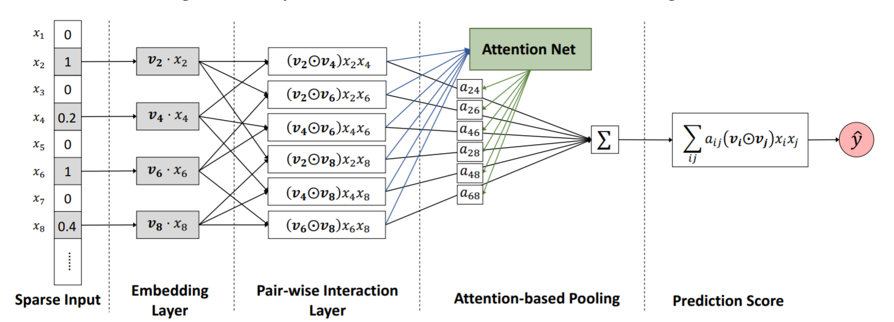

# AFM: Attentional Factorization Machines
2020/07/13

浙江大学 & 新加坡国立大学\[IJCAI 2017\][Attentional Factorization Machines: Learning the Weight of Feature Interactions via Attention Networks](https://www.ijcai.org/Proceedings/2017/0435.pdf) (ver. IJCAI)

## 前言

这篇AFM也是何向南博士出品的FM衍生系列模型，从时间上看应该和NFM是同期的（文中提到“is orthogonal with NFM”），而Attention机制在NMT中开始推广是2015年，从时间上看AFM把注意力机制应用到FM上算是一个十分前沿的想法。直观上来看，AFM对FM的改进主要是是对二阶交叉特征利用注意力机制进行加权，从二阶交叉特征中选择更为重要的交叉特征。

### 太长不看版结论

优点：使用注意力机制对二阶交叉特征进行加权，强化重要的同时削弱不重要的交叉特征的影响。

缺点：AFM依然属于浅层模型，因此其特征表达能力不及带有隐藏层的NFM。

## 正文

### 动机

摘要部分清楚地解释了AFM的动机，并在introduction部分作了细节的描述：

> FM can be hindered by its modelling of all feature interactions with the same weight, as not all feature interactions are equally useful and predictive.
>
> different predictor variables usually have different predictive power, and not all features contain useful signal for estimating the target
>
>  FM lacks such capability of differentiating the importance of feature interactions, which may result in suboptimal prediction.

简单翻译一下，FM对二阶交叉特征赋予相同的权重，这些交叉特征应当在不同的情况下有不同的重要程度，且不是所有的交叉特征都具有预测作用，因此FM可能会导致一些次优的预测结果。

### 模型结构与pytorch实现

照例先放上一张AFM的模型结构图：



由于AFM是一个浅层结构，模型并不复杂。Embedding层依然使用的是所有特征等长的嵌入，连续特征使用嵌入*值的处理方式：

```python
# __init__
self.emb_layer = nn.Embedding(num_embeddings=num_feats, embedding_dim=emb_dim)
nn.init.xavier_uniform_(self.emb_layer.weight)

# forward
feat_value = feat_value.unsqueeze(2)
feat_emb = self.emb_layer(feat_index)  # N * num_fields * emb_dim
feat_emb_value = torch.mul(feat_emb, feat_value)
```

接着是Pair-wise Interaction(PI)层，PI层和FM的二阶交互层仅有一个不求和的区别，但正是这个区别导致PI层不能通过类似FM的简化方式进行计算，因此要先构造特征交叉对的序列然后再统一进行特征交叉和计算：

$$ f_{PI}(\mathcal{E})={\{(v_i \odot v_j)x_ix_j\}}_{(i,j)\in \mathcal{R}_x} \tag{1} $$

```python
# forward
p, q = build_cross(self.num_fields, feat_emb_value)
pair_wise_inter = torch.mul(p, q)
```

然后是Attention-based Pooling注意力池化层，是一个经典的Location-based注意力机制（无Query、Key、Value的概念，只和每个元素的值以及其位置有关），使用Softmax进行注意力信号值归一化：

$$ a^{'}_{ij}=h^TReLU(W(v_i \odot v_j)x_ix_j+b) \tag{2} $$
$$ a_{ij}={\rm Softmax}(a^{'}_{ij})=\frac{{\rm exp}(a^{'}_{ij})}{\sum_{(i,j)\in \mathcal{R}_x}{{\rm exp}(a^{'}_{ij})}} \tag{3} $$
$$ f_{Att}(f_{PI}(\mathcal{E}))=\sum_{(i,j)\in \mathcal{R}_x}{a_{ij}(v_i \odot v_j)x_ix_j} \tag{4} $$

这里使用一个LocationBasedAttention模块来注意力机制的计算：

```python
# __init__ in LocationBasedAttention
self.weights = nn.Parameter(torch.zeros(emb_dim, att_weight_dim))
nn.init.xavier_uniform_(self.weights.data)
self.bias = nn.Parameter(torch.randn(att_weight_dim))
self.h = nn.Parameter(torch.randn(att_weight_dim))

# forward in LocationBasedAttention
att_signal = torch.matmul(values, self.weights)  # N * num * att_weight_dim
att_signal = att_signal + self.bias  # N * num * att_weight_dim
att_signal = F.relu(att_signal)
att_signal = torch.mul(att_signal, self.h)  # N * num * att_weight_dim
att_signal = torch.sum(att_signal, dim=2)  # N * num
att_signal = F.softmax(att_signal, dim=1)  # N * num

# __init__ in AFM
self.att_layer = LocationBasedAttention(emb_dim, att_weight_dim)
self.p = nn.Parameter(torch.randn(emb_dim))

# forward in AFM
att_signal = self.att_layer(pair_wise_inter)  # N * num_pairs
att_signal = att_signal.unsqueeze(dim=2)  # N * num_pairs * 1
att_inter = torch.mul(att_signal, pair_wise_inter)  # N * num_pairs * emb_dim
att_pooling = torch.sum(att_inter, dim=1)  # N * emb_dim
att_pooling = torch.mul(att_pooling, self.p)  # N * emb_dim
att_pooling = torch.sum(att_pooling, dim=1)  # N
```

最后，把一阶线性和注意力池化的结果加起来得到预测结果：

$$ \hat{y}_{AFM}(x)=w_0+\sum_{i=1}^{n}{w_ix_i}+p^T\sum_{i=1}^{n}{\sum_{j=i+1}^{n}{a_{ij}(v_i \odot v_j)x_ix_j}} \tag{5} $$

```python
# __init__
self.first_order_weights = nn.Embedding(num_embeddings=num_feats, embedding_dim=1)
nn.init.xavier_uniform_(self.first_order_weights.weight)
self.bias = nn.Parameter(torch.randn(1))

# forward
first_order_weight = self.first_order_weights(feat_index)  # N * num_fields * 1
y_first_order = torch.mul(first_order_weight, feat_value)  # N * num_fields * 1
y_first_order = torch.sum(y_first_order, dim=1)  # N * 1
y_first_order = y_first_order.squeeze(1)
y = self.bias + y_first_order + att_pooling
y = self.output_layer(y)
```

最后整理得到的完整代码如下(model/ctr/afm.py)（Attention模块在这里没有附，见model/basic/attention.py）：

```python
import torch
import torch.nn as nn
import torch.nn.functional as F
from model.basic.output_layer import OutputLayer
from model.ctr.pnn import build_cross
from model.basic.attention import LocationBasedAttention


class AFM(nn.Module):
    def __init__(self, emb_dim, num_feats, num_fields, att_weight_dim, out_type='binary'):
        super(AFM, self).__init__()
        self.emb_dim = emb_dim
        self.num_feats = num_feats
        self.num_fields = num_fields
        self.att_weight_dim = att_weight_dim
        self.first_order_weights = nn.Embedding(num_embeddings=num_feats, embedding_dim=1)
        nn.init.xavier_uniform_(self.first_order_weights.weight)
        self.bias = nn.Parameter(torch.randn(1))
        self.emb_layer = nn.Embedding(num_embeddings=num_feats, embedding_dim=emb_dim)
        nn.init.xavier_uniform_(self.emb_layer.weight)
        self.num_pairs = num_fields * (num_fields - 1) / 2

        self.att_layer = LocationBasedAttention(emb_dim, att_weight_dim)
        self.p = nn.Parameter(torch.randn(emb_dim))

        self.output_layer = OutputLayer(1, out_type)

    def forward(self, feat_index, feat_value):
        feat_value = feat_value.unsqueeze(2)  # N * num_fields * 1
        # first order
        first_order_weight = self.first_order_weights(feat_index)  # N * num_fields * 1
        y_first_order = torch.mul(first_order_weight, feat_value)  # N * num_fields * 1
        y_first_order = torch.sum(y_first_order, dim=1)  # N * 1
        y_first_order = y_first_order.squeeze(1)

        feat_emb = self.emb_layer(feat_index)  # N * num_fields * emb_dim
        feat_emb_value = torch.mul(feat_emb, feat_value)  # N * num_fields * emb_dim

        p, q = build_cross(self.num_fields, feat_emb_value)  # N * num_pairs * emb_dim
        pair_wise_inter = torch.mul(p, q)

        att_signal = self.att_layer(pair_wise_inter)  # N * num_pairs
        att_signal = att_signal.unsqueeze(dim=2)  # N * num_pairs * 1

        att_inter = torch.mul(att_signal, pair_wise_inter)  # N * num_pairs * emb_dim
        att_pooling = torch.sum(att_inter, dim=1)  # N * emb_dim

        att_pooling = torch.mul(att_pooling, self.p)  # N * emb_dim
        att_pooling = torch.sum(att_pooling, dim=1)  # N

        y = self.bias + y_first_order + att_pooling
        y = self.output_layer(y)
        return y
```

### 模型分析

何向南博士的AFM和NFM作为正交的两篇paper，不论是从写作结构、模型描述还是实验的设计和写法（RQ1、2、3），两篇paper都几乎是一样的，AFM还被NFM给diss了（NFM还是何博士一作的亲儿子啊）：

> More recently, Xiao et al. [38] proposed attentional FM, using an attention network [7, 39] to learn the importance of each feature interaction. However, these variants are all linear extensions of FM and model the second-order feature interactions only.

现在让我们回到AFM的模型上来。从现在这个时间点往回看，AFM其实已经没有太多可以分析的点了，因为注意力机制已经是一个广泛应用于各个场景的算法模块了，AFM简单使用Location-based Attention对二阶交叉特征进行加权池化的计算过程并无太多可以深挖的点（无非是注意力机制能够给重要的部分更高的权重，减少噪声误差如此等等）。

但笔者一直认为AFM通过注意力进行加权池化的过程其实一定程度上缓解了梯度耦合现象（梯度耦合现象的理论研究篇将在FwFM和FLEN更新后添加），简单来说就是在BP的梯度下降过程中，特征$x_i$的嵌入向量更新受到其他特征$x_j$的影响（虽然FFM的paper中没有提到，但是field-wise/aware的模型具有良好的梯度耦合抑制能力）。

假设目标函数为$L=f(y,\hat{y})$，那么在FM算法中，我们能够得到$v_i$的梯度为：

$$ \hat{y}=w_0+\sum_{i=1}^{n}{w_ix_i}+\sum_{i=1}^{n}{\sum_{j=i+1}^{n}{\langle v_i,v_j \rangle x_ix_j}} \tag{6} $$
$$ \frac{\partial{L}}{\partial{v_i}}=\frac{\partial{L}}{\partial{f}}\sum_{j\neq i}{v_jx_ix_j} \tag{7}$$

我们很容易发现，对于特征$i$的嵌入向量$v_i$，其值的更新完全依赖于其他特征的嵌入向量，即上面说的梯度耦合现象。我们来看下在AFM中embedding的更新梯度计算。首先先回顾一下AFM的$\hat{y}$计算过程以及注意力信号值的计算过程：

$$ \hat{y}_{AFM}(x)=w_0+\sum_{i=1}^{n}{w_ix_i}+p^T\sum_{i=1}^{n}{\sum_{j=i+1}^{n}{a_{ij}(v_i \odot v_j)x_ix_j}} $$
$$ a_{ij}={\rm Softmax}(a^{'}_{ij})=\frac{{\rm exp}(a^{'}_{ij})}{\sum_{(i,j)\in \mathcal{R}_x}{{\rm exp}(a^{'}_{ij})}} $$

此时$a_{ij}$是$v_i$的函数，因此$a_{ij}(v_i \odot v_j)$用求导法则展开：

$$ \frac{\partial{L}}{\partial{v_i}}=\frac{\partial{L}}{\partial{f}}p\odot \sum_{j\neq i}({\frac{\partial{a_{ij}}}{\partial{v_i}}(v_i\odot v_j)x_ix_j+a_{ij}v_jx_ix_j)} \tag{8} $$
$$ = \frac{\partial{L}}{\partial{f}}p \odot (v_ix_i\sum_{j\neq i}{\frac{\partial{a_{ij}}}{\partial{v_i}}}v_jx_j + x_i\sum_{j\neq i}{a_{ij}v_jx_j}) \tag{9} $$

（9）式括号内$\frac{\partial{a_{ij}}}{\partial{v_i}}$展开得到

$$ \frac{\partial{a_{ij}}}{\partial{v_i}} = \frac{\partial{a_{ij}}}{\partial{a^{'}_{ij}}} \frac{\partial{a^{'}_{ij}}}{\partial{v_i}} = a_{ij}(1-a_{ij})\frac{\partial{a^{'}_{ij}}}{\partial{v_i}} \tag{10} $$

不论激活函数是ReLU及其变体还是传统全局可微的非线性函数tanh、sigmoid，$\frac{\partial{a^{'}_{ij}}}{\partial{v_i}}$都是一个$v_j$的非线性变换结果，只与$v_j$以及相关参数有关，因为参数并不影响梯度耦合的讨论，因此忽略参数，记作$\frac{\partial{a^{'}_{ij}}}{\partial{v_i}}=\phi(i,v_j)$

将（10）代回（9）可以得到：

$$ \frac{\partial{L}}{\partial{v_i}}=\frac{\partial{L}}{\partial{f}}px_i \odot \sum_{j\neq i}{(a_{ij}(1-a_{ij})\phi(i,v_j)(v_i\odot v_j)x_j+a_{ij}v_jx_j)} \tag{11} $$

从（11）中可以看到，虽然梯度形式变得相当复杂，但是$v_i$不再直接受$v_j$的影响，而是转变为受到其他一阶线性特征和二阶特征以及注意力信号值函数参数的间接影响，从而使得模型整体的性能得到一定的提升。但这种缓解只是从直接转变为间接，从（11）式中我们依然能看到，每一项中都包含$v_j$，这样对梯度耦合的缓解能力是远不如field-wise/aware的相关模型的。

### 复现相关参数设置

数据集：Frappe，5382特征；MovieLens-full（userID，movieID，tag），90445特征

评价指标：RMSE（回归任务）

嵌入维度：256

attention嵌入维度：256

batch size：Frappe 128；MovieLens 4096

过拟合：L2正则

优化器：最小批Adagrad

paper中的实验结果

Frappe数据集

|参数量|RMSE|
|:---|:---|
|1.45M|0.3102|

MovieLens数据集

|参数量|RMSE|
|:---|:---|
|23.26M|0.4325|