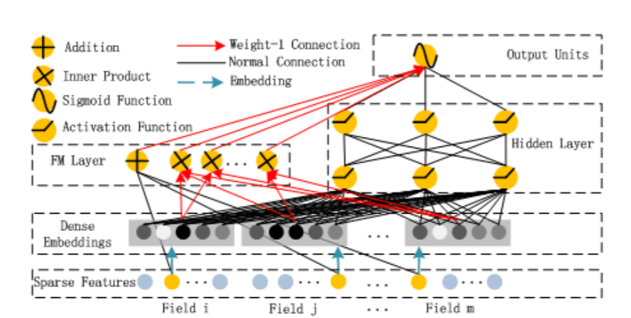

# DeepFM
2020/06/27

华为\[IJCAI2017\][DeepFM: A Factorization-Machine based Neural Network for CTR Prediction](https://www.ijcai.org/Proceedings/2017/0239.pdf)(ver. IJCAI2017)

## 前言

DeepFM模型是Wide & Deep Network模型结构的发展形态，其主要的变动是使用一个FM算法代替了Wide网络的LR算法，使Wide网络能够自动进行二阶特征交叉；同时将FM算法中的$v_i$作为Deep网络的embedding来使用。

### 太长不看版结论

优点：作为一个“端到端”模型，DeepFM的性能更稳定，不会因为分开训练embedding而引入额外的偏差；使用FM代替LR作为Wide网络部分，且Wide网络和Deep网络共享同一embedding输入，大幅减少了人工选择交叉特征的特征工程成本；利用在FM上的BP优化embedding，使embedding层始终能够保持隐式二阶特征交叉信息。

缺点：利用FM代替LR后，Wide部分的“记忆能力”下降，使模型整体发生过度泛化的风险增加；高阶FM模型的复杂度极高，因此DeepFM使用二阶FM模型，使得DeepFM没有高阶特征交叉的能力（LR模型可以人工实现任意阶的特征交叉，但对先验的要求很高）。

## 正文

### 动机

这篇paper的动机分散在introduction的各个部分，实际上表达得非常不明确（这篇paper在introduction部分的每一段并没有对提及模型所具有的问题进行总结，因此只能从描述的每一个模型的问题来推断到底试图解决什么问题）

> Despite great progress, existing methods seem to have a strong bias towards low- or high-order interactions, or require expertise feature engineering. (来自abstract)
>
> In this model (指Wide & Deep Network), two different inputs are required for the “wide part” and “deep part”, respectively, and the input of “wide part” still relies on expertise feature engineering.


简单翻译一下：
1. 现有模型只能偏向低阶交互或是高阶交互或是依赖专门的特征工程
2. Wide & Deep Network使用在Wide和Deep部分使用了不同的输入，Wide部分的输入依赖专门的特征工程（指人工选择特征交叉）

所以针对上面的三个问题，DeepFM的解决是：

1. 利用FM学习低阶交互，深度模型学习高阶交互，两者并行（实际上笔者认为深度模型学习到的并不是所谓的“交互”）
2. Wide部分和Deep部分使用同一个输入（就可以不要专门的特征交叉选择）

### 模型结构与pytorch实现

paper里的这张模型图放大以后就糊了，所以只能将就着看一下了



实际上DeepFM和Wide & Deep Network一样是一个结构很简单的模型，实际上只有FM、MLP和sigmoid三个部分。

首先是FM部分。这个FM部分和FM算法是完全一样的，包含两个一阶线性部分和二阶特征交叉部分：

$$ y_{FM}=\langle w,x \rangle + \sum_{i=1}^{d}{\sum_{j=i+1}^{d}{\langle V_i,V_j \rangle x_i \cdot x_j}} \tag{1} $$

这里FM只需要输出一个计算出的数值即可，因此FM模块的输出类型设置为回归。

```python
# __init__
self.fm = FM(emb_dim, feat_dim, out_type='regression')

# forward
y_fm = self.fm(feat_index, feat_value)  # N
```

然后是深度部分，是一个MLP网络。这里的MLP输入是FM的$v_i$，所以要先从fm中取出$v_i$的embedding层，然后把embedding结果展平作为MLP的输入。

$$ a^{(0)}=[e_1,e_2,...,e_m] \tag{2} $$
$$ a^{(l+1)}=\sigma(W^{(l)}a^{(l)}+b^{{l}}) \tag{3} $$

```python
# __init__
self.dnn = MLP(emb_dim * num_fields, fc_dims, dropout, batch_norm)

# forward
emb_layer = self.fm.get_embedding()
feat_emb = emb_layer(feat_index)
dnn_in = feat_emb.reshape(-1, self.emb_dim * self.num_fields)  # N * (emb_dim * num_fields)
y_dnn = self.dnn(dnn_in)
```

最后的输出层将FM部分和MLP部分加起来用sigmoid函数输出：

$$ y_{DNN}=W^{|H|+1} \cdot a^{|H|+1}+b^{|H|+1} \tag{4} $$
$$ y=sigmoid(y_{FM}+y_{DNN}) \tag{5} $$

实际上这里和将FM和DNN最后一层神经元拼接起来以后传入一个sigmoid神经元是等效的。

```python
# __init__
self.output_layer = OutputLayer(fc_dims[-1] + 1, out_type)

# forward
y = torch.cat((y_fm, y_dnn), dim=1)  # N * (fc_dims[-1] + 1)
y = self.output_layer(y)
```

最后整理得到的（model/ctr/deepfm.py）：

```python
import torch
import torch.nn as nn
from model.basic.mlp import MLP
from model.ctr.fm import FM
from model.basic.output_layer import OutputLayer


class DeepFM(nn.Module):

    def __init__(self, emb_dim, feat_dim, num_fields, fc_dims=None, dropout=None, batch_norm=None, out_type='binary'):
        super(DeepFM, self).__init__()
        # embedding layer is embedded in the FM sub-module
        self.emb_dim = emb_dim

        # fm
        self.fm = FM(emb_dim, feat_dim, out_type='regression')

        # dnn
        if not fc_dims:
            fc_dims = [32, 32, 32]
        self.fc_dims = fc_dims
        self.num_fields = num_fields
        self.dnn = MLP(emb_dim * num_fields, fc_dims, dropout, batch_norm)

        # output
        self.output_layer = OutputLayer(fc_dims[-1] + 1, out_type)

    def forward(self, feat_index, feat_value):
        # embedding
        emb_layer = self.fm.get_embedding()
        feat_emb = emb_layer(feat_index)

        # compute y_FM
        y_fm = self.fm(feat_index, feat_value)  # N
        y_fm = y_fm.unsqueeze(1)  # N * 1

        # compute y_dnn
        # reshape the embedding matrix to a vector
        dnn_in = feat_emb.reshape(-1, self.emb_dim * self.num_fields)  # N * (emb_dim * num_fields)
        y_dnn = self.dnn(dnn_in)  # N * fc_dims[-1]

        # compute output
        y = torch.cat((y_fm, y_dnn), dim=1)  # N * (fc_dims[-1] + 1)
        y = self.output_layer(y)
        return y
```

### 模型分析

先借用paper自己的描述来总结一下：

> 1. it does not need any pre-training
> 2. it learns both high- and low-order feature interactions
> 3. it introduces a sharing strategy of feature embedding to avoid feature engineering.

实际上，这三点是分别针对不同的现有模型提出的：
1. FNN需要使用FM预训练其embedding层
2. PNN只能学习高阶特征交互，FM只能学习低阶（二阶）特征交互（笔者并不赞同高阶特征交互的说法，但此处先顺着paper的意思来解释）
3. Wide & Deep在Wide部分需要专门的特征工程来选择交叉特征

在这里笔者提一嘴“高阶特征交互”的说法。很多paper都把深度MLP模型得到的结果称为“high-order feature interactions”，虽然不能说这是错误的，但笔者认为这并不恰当。从计算形式上来看，MLP是非线性激活函数+特征线性组合的计算形式，并不存在某两个特征之间的直接interaction。“高阶特征交互”应该指的是DCN、xDeepFM的CIN这样的多次进行交叉求积的形式。

回到DeepFM模型上来。DeepFM的并联模型相比Wide & Deep Network，使用了同一组embedding作为两个部分的输入，这使得Wide & Deep Network的“相互制衡”策略在DeepFM中得到了升级，在BP更新embedding的时候，FM部分和MLP部分能够“相互学习”：FM模型保持了embedding中的隐式二阶特征交叉信息（交叉特征权重=两个特征的嵌入向量内积），而MLP强化了embedding的泛化能力。

### 复现相关参数设置

数据集：Criteo(90%训练，10%验证)；华为应用商店数据（不明确有没有公开）

MLP神经元个数：400, 400, 400(3层，水桶型结构)

Embedding维度：10

优化器：MLP部分：Adam；FM部分：FTRL

激活函数：ReLU

过拟合：dropout：0.5

paper中的实验结果：

Criteo数据集：

|AUC|LogLoss|
|:---|:---|
|0.8016|0.44985|