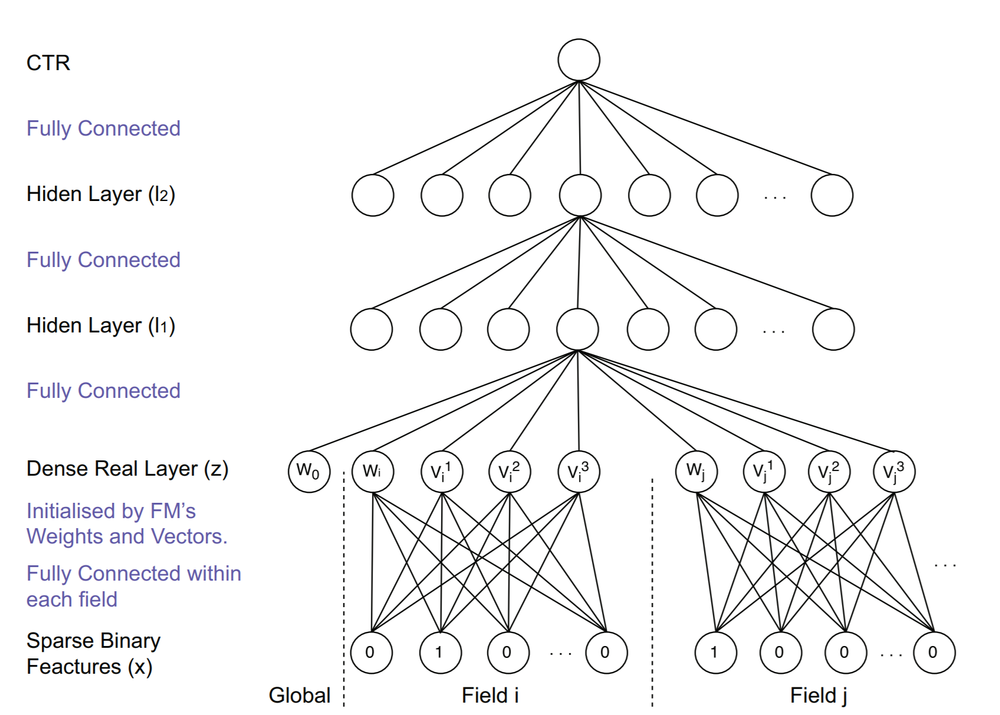

# FNN: Factorization-machine supported Neural Network
2020/06/19

UCL & RayCloud（杭州）\[ECIR 2016\][Deep Learning over Multi-field Categorical Data – A Case Study on User Response Prediction](https://arxiv.org/pdf/1601.02376.pdf) (ver. arXiv-v1)

## 前言

从这个时间点看FNN已经是一个老模型了，作为早期的特征交叉+深度学习的模型，FNN对后续的模型DeepFM、NFM等有很好的启发，但本身的问题也很多，从现在看已经难以算得上是一个很好的baseline了。此外，FNN只是该paper中的一个模型，该paper还提出了一个基于采样的神经网络SNN（Sampling-based Neural Network），SNN直接将稀疏编码连接到神经网络，并使用受限玻耳兹曼网络、降噪自编码器进行模型预训练但在实验结果上低于FNN，而且从结构上看也只能说是对高维稀疏向量在深度模型里直接使用的一次尝试，结构创新性不足，因此SNN在推荐系统领域中具有的热度和价值都要低于FNN。

### 太长不看版结论

优点：将FM与深度模型结合，利用深度模型逐层抽取高级特征，强化FM嵌入的表征能力。

缺点：除了预训练FM嵌入向量隐含的特征交叉信息（以内积计算得出的权重），FNN没有对特征进行交叉。由于深度模型本身缺少拟合向量积的能力，难以进一步对特征交叉信息进行建模。

## 正文

### 动机

我们在paper的introduction部分找到了作者提出FNN（和SNN）的动机：

> However, these models (指FM、GBDT) cannot make use of all possible combinations of different features. In addition, many models require feature engineering that manually designs what the inputs should be.
> Another problem of the mainstream ad CTR estimation models is that most prediction models have shallow structures and have limited expression to model the underlying patterns from complex and massive data. As a result, their data modelling and generalisation ability is still restricted.

简单翻译一下就是，作者认为：
1. FM和GBDT不能完全利用所有可能的特征组合形式，并且很多因子化模型需要大量的人工特征工程
2. 主流的CTR预估模型往往只有浅层模型，因此他们的特征表达能力在数据量大、数据复杂的情况下受到模型的限制，从而导致他们的数据建模能力和泛化能力也受到模型限制。

到2016年（实际上实验等相关研究应该是在2015年），正好是深度学习大火开始进入公众视野的那段时间。作者自称是第一个在CTR领域使用深度学习的模型，试图使用深度模型加强模型整体的表征能力（最后虽然实验结果一般般，但既蹭到了热度又作为先驱者启发了后续的众多模型）。

### 模型结构与pytorch实现

先来看看模型结构图：


<div style="text-align: center;">图1：FNN模型结构图</div>

按照惯例，我们从输出层开始往输入看。

输出层是一个sigmoid输出，代表一个二分类结果（即预估CTR概率值）。

$$ \hat{y}={\rm sigmoid}(W_3l_2+b_3) \tag{1} $$

不像tensorflow一样可以直接写成一个激活函数是sigmoid的、神经元个数为1的dense层（全连接层），pytorch中需要手动进行sigmoid，全连接层模块Linear只能提供线性模型的部分。根据笔者所倾向的模块化设计，大部分输出层都是采用这样的形式，很适合用一个输出层模块去代替（见DeepRec-torch中的OutputLayer模块）。

```python
# 在__init__部分
self.output_dense=nn.Linear(in_features=l2_dim,out_features=1,bias=True)
# 使用输出层模块
self.output_layer=OutputLayer(in_dim=l2_dim,out_type='binary')

# 在forward部分
y=self.output_dense(l2_out)
y=nn.Sigmoid(y)
# 使用输出层模块
y=self.output_layer(l2_out)
```

$l_2$和$l_1$层是两个全连接层：

$$ l_2={\rm tanh}(W_2l_1+b_2) \tag{2} $$
$$ l_1={\rm tanh}(W_1z+b_1) \tag{3} $$

这两个全连接层分开写也不会多出很多代码，而使用模块化思想则是用一个包装好的MLP（见DeepRec-torch中的MLP模块）去代替两个全连接层。

```python
# 在__init__部分
self.l2=nn.Linear(in_features=l1_dim,out_features=l2_dim,bias=True)
self.l1=nn.Linear(in_features=z_dim,out_features=l1_dim,bias=True)
nn.init.xavier_uniform_(self.l2.weight)
nn.init.xavier_uniform_(self.l1.weight)
# 使用MLP模块
self.fc_layers=MLP(fc_dims=[l1_dim,l2_dim],in_dim=z_dim,dropout,batch_norm)

# 在forward部分
l1_out=self.l1(z)
l2_out=self.l2(l1_out)
# 使用MLP模块
l2_out=self.fc_layers(z)
```

最后是预训练FM的嵌入层：

$$ z=(w_0,z_1,z_2,...,z_n) \tag{4} $$
$$ z_i=W_0^i \cdot x[{\rm start}_i : {\rm end}_i]=(w_i,v_i^1,v_i^2,...,v_i^K) \tag{5} $$

根据图1中给出的形式，在稀疏二值特征输入中，每个field中应当只有一个神经元的值为1，那么这个field和FFM中的field-aware实际上并不代表同一个含义：FNN中的field代表的是在类别信息转化为one-hot编码的一组特征，这一组特征的原始值属于同一个类别字段。那么这时，其嵌入形式就和FM没什么两样了；而对于多标签字段，在转化成multi-hot编码后，根据（4）式给出的形式，最终的field embedding是将每个标签的embedding直接加起来。所以FNN理论上也支持含有多标签字段的输入数据。

```python
# 在__init__部分
self.emb_layer=nn.Embedding(num_embeddings=num_feats,embedding_dim=K+1)
nn.init.xavier_uniform_(self.emb_layer.weight)

# 在forward部分
feat_emb=self.emb_layer(feat_index) # batch_size * num_fields * emb_dim
# 存在多标签字段
feat_emb_value=torch.mul(feat_emb,feat_value)   # batch_size * num_fields * emb_dim
feat_onehot_fields=feat_emb_Value[:,onehot_fields]
feat_multihot_fields=[
    feat_emb_value[:,field_range].sum(dim=1).unsqueeze(dim=1)   # batch_size * 1 * emb_size
    for field_range in multihot_field_ranges
]
feat_multihot_fields=torch.cat(feat_multihot_fields,dim=1)
feat_emb_value=torch.cat([feat_onehot_fields,feat_multihot_fields],dim=1)
z=feat_emb_value.reshape((-1,(K+1)*num_fields)
#不存在多标签字段
z=feat_emb_value.reshape((-1,(K+1)*num_fields)
```

至于使用预训练的FM嵌入向量，这部分可以有多种实现方式。笔者在DeepRec-torch的实现中使用了在FNN中内置一个FM的方式，使整个模型的调用更加方便，只需要用训练flag来切换让模型训练FM嵌入还是FNN即可。当然直接在FNN模型初始化时传入一个nn.Embedding层作为初始化参数或是调用专门的embedding模块（参照DeepCTR作者浅梦大佬的思路）也是很好的实现方式。FM的实现代码在此处就不放了，可以参考DeepRec-torch中的FM模块。

训练相关部分部分，目标函数使用了交叉熵函数：

$$ L(y,\hat{y})=-y\log{\hat{y}}-(1-y)\log{1-\hat{y}} \tag{6} $$

```python
import torch.nn as nn
loss_func=torch.nn.BCELoss()
```

整理一下这一段内容，我们设计并实现一个继承nn.Module的FNN类（model/ctr/fnn.py）（最后并没有对多标签的字段进行处理）：

```python
import torch
import torch
import torch.nn as nn
from model.ctr.fm import FM
from model.basic.mlp import MLP
from model.basic.output_layer import OutputLayer


class FNN(nn.Module):

    def __init__(self, emb_dim, num_feats, num_fields, fc_dims=None, dropout=None, batch_norm=None, out_type='binary',
                 train_fm=True):
        super(FNN, self).__init__()
        # set model object to training FNN or training FM embedding
        self.fm_trained = not train_fm

        # embedding layer is embedded in the FM sub-module
        self.emb_dim = emb_dim
        self.num_feats = num_feats

        # fc layers
        if not fc_dims:
            fc_dims = [32, 32]
        self.fc_dims = fc_dims
        self.num_fields = num_fields
        self.fc_layers = MLP(emb_dim * num_fields, fc_dims, dropout, batch_norm)

        # fm model as the pre-trained embedding layer
        self.fm = FM(emb_dim, num_feats, out_type)

        # output
        self.output_layer = OutputLayer(fc_dims[-1], out_type)

    def forward(self, feat_index, feat_value):
        if not self.fm_trained:
            y = self.fm(feat_index, feat_value)
        else:
            emb_layer = self.fm.get_embedding()
            feat_emb = emb_layer(feat_index)

            # reshape the embedding matrix to a vector
            fc_in = feat_emb.reshape(-1, self.emb_dim * self.num_fields)

            y = self.mlp(fc_in)

            # compute output
            y = self.output_layer(y)
        return y

    def train_fm_embedding(self):
        self.fm_trained = True

    def train_fnn(self):
        self.fm_trained = False
```

### 模型分析

从上一节的内容看，FNN的网络结构其实非常简单：高维稀疏特征输入-embedding层-MLP-sigmoid输出概率。而FNN也代表了深度学习与推荐系统领域，尤其是特征交叉这个方向的第一次接触，在当时很多理论的研究还很少，可供参考的内容也不多，因此FNN有一些问题也是很正常的。其动机的第一条，对于特征交叉来说，尤其以向量积作为交叉方式，FNN提出的利用深度模型去完成所有可能的特征组合形式是不太现实的，而特征线性组合的方式得到的高阶特征并不能算是特征交叉；但其动机的第二条，利用深度模型强化模型整体对数据的表征和建模能力，是确实有效的。

详细来说第一条的话，关于深度学习到底能不能拟合向量积，在学术界的讨论也不少，最近FM的作者Rendle大佬也对Neural Collaborative Filtering中利用深度学习代替MF交叉的有效性提出了质疑，认为只是利用深度学习的强表征能力弥补了本身特征交叉能力的薄弱；而NCF的作者何向南博士也做出回应，基本认可了这一观点，并引用自己在Neural Factorization Machines对相关问题的讨论进行了证明。从笔者对这一方面的理解和一些小实验来看，深度模型确实难以拟合向量积，而且深度模型从结构上看根本不适合做特征交叉相关的工作，更详细的理论和相关实验可以看笔者后续在理论研究板块中的相关文章。

回到FNN这个模型，FNN使用预训练的FM嵌入向量作为深度网络的输入，一定程度上弥补了深度学习难以做特征交叉的弱点。因为FM对每一个特征生成了嵌入向量，使用的是feature-wise的特征交叉（一般的MF因子化是对每一个用户和物品分别生成嵌入向量，笔者称其为id-wise）。这样的特征交叉形式产生的权重是两个特征嵌入向量的内积，内积通过学习不断优化（这个内积并不能用来表征两个特征的相似度/相关度），所以通过预训练FM得到的嵌入向量其实隐含了特征交叉方面的信息。

最后，FNN模型确实为深度学习在CTR预估和特征交叉方向上开了一个好头，为后续的一系列模型提供了很好的思路。

### 复现相关参数设置

数据集：iPinYou，取了id为1458, 2259, 2261, 2997, 3386的4个广告提供商数据以及全部数据集，共6个set

特征预处理：所有字段都是类别字段，采用one-hot编码预处理（共937.67k个特征）

评价指标：AUC

paper中的实验结果：

|dataset|FNN|
|:---|:---|
|1458|70.52%|
|2259|69.74%|
|2261|62.99%|
|2997|61.41%|
|3386|80.56%|
|all|70.70%|

全连接层神经元个数：200，300，100（菱形结构）

过拟合：dropout：0.8；无正则