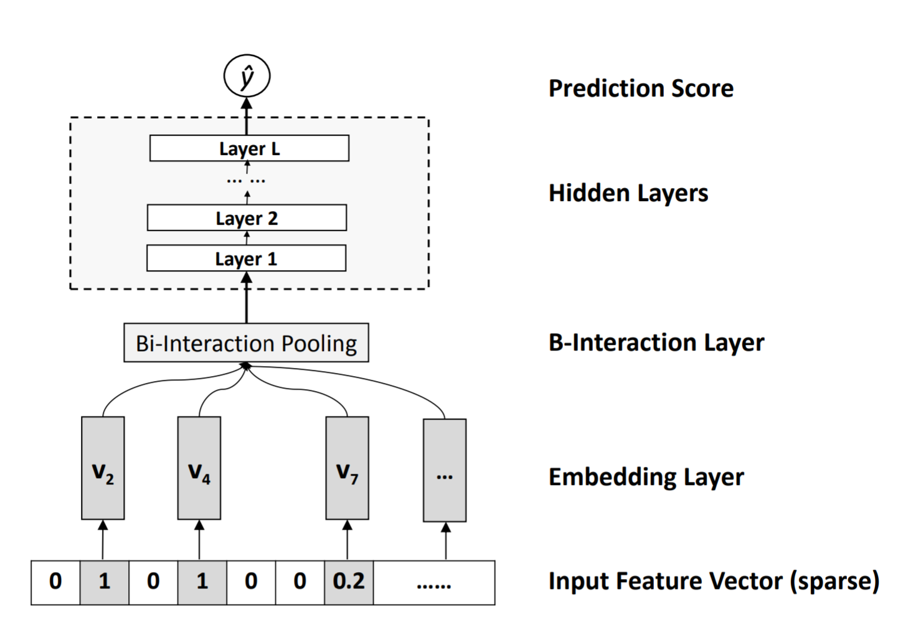

# NFM: Neural Factorization Machines
2020/07/06

新加坡国立大学\[SIGIR2017\][Neural Factorization Machines for Sparse Predictive Analytics](http://staff.ustc.edu.cn/~hexn/papers/sigir17-nfm.pdf)(ver. ustc)

## 前言

NFM是何向南博士继Neural Collaborative Filtering (NCF)后在深度+推荐领域的又一尝试，进一步讨论了深度模型在推荐场景下的应用性能，并从实验结果中导出“很深的模型是没有必要的“这一结果（1层的NFM-1的结果最好），笔者认为这一结论可以推广到大部分特征交叉串联MLP结构的模型上。

### 太长不看版结论

优点：使用串联结构将深度模型接在FM变形的双交互层后，提升了FM模型的表达能力；虽然相比FM只多了（1层的）MLP，但可以通过dropout、BN等优化方法来提升模型的性能，更易于训练和优化

缺点：笔者觉得并没有什么明显的缺陷，硬要说的话就是不支持高阶特征交互。（实际上从2017年开始，大部分基于特征交叉的新模型就已经处于细节性的优化了，而不是像之前那种改进得到一个大优势的同时引入某些缺陷，可以说是发展的很快了（大概也是热度远低于NLP和CV的一大原因））

## 正文

### 动机

动机能在abstract中找到，并在第2章中有明确的问题描述和解释：

> However, FM models feature interactions in a linear way, which can be insufficient for capturing the non-linear and complex inherent structure of real-world data.
>
> While deep neural networks have recently been applied to learn non-linear feature interactions in industry, ...,, the deep structure meanwhile makes them difficult to train.

通过上述两个主要动机，我们可以看到：
1. NFM试图利用深度模型来加强FM的表达能力
2. 过深的MLP模型会导致难以训练

所以何向南博士意在提出一个浅层MLP与FM结合的模型，而浅层的MLP本身的表达/归纳能力是不足的，因此只能以FM串联浅层MLP的形式进行两者的结合，即我们将要讨论的NFM模型。

### 模型结构与pytorch实现

NFM模型的结构也非常简单明了（一阶线性部分为了结构图整体的简洁清晰没有画上去）：



一上来依然是一个平平无奇的embedding层，使用的是最常规对field中每一个类别赋予一个embedding向量。对连续特征的处理是使用连续特征的值数乘embedding向量。

```python
# __init__
self.emb_layer = nn.Embedding(num_embeddings=num_feats, embedding_dim=emb_dim)
nn.init.xavier_uniform_(self.emb_layer.weight)

# forward
feat_emb = self.emb_layer(feat_index)  # N * num_fields * emb_dim
feat_value = feat_value.unsqueeze(dim=2)  # N * num_fields * 1
feat_emb_value = torch.mul(feat_emb, feat_value)  # N * num_fields * emb_dim
```

接着是NFM的核心部分双交互层Bi-Interaction Layer。BI层和FM的二阶特征交叉部分几乎完全一致，只是将$v_i^Tv_j$的内积形式替换成了element-wise积（即哈达玛积），因此最后BI层输出一个长度为embedding_dim的向量。

$$ f_{BI}(V_x)=\sum_{i=1}^{n}{\sum_{j=i+1}^{n}{x_iv_i \odot x_jv_j}} \tag{1} $$

这里同样可以按照FM算法的优化形式进行优化：

$$ f_{BI}(V_x)=\frac{1}{2}[(\sum_{i=1}^{n}{x_iv_i})^2-\sum_{i=1}^{n}{(x_iv_i)^2}], v^2=v \odot v \tag{2} $$

出于模块化考量，在FM、NFM以及后续的FLEN等模型上均使用了BI层，将BI层抽象成一个封装了functional的Layer（BI层内部不包含额外的参数，参考torch.nn中ReLU等层的设计）：

```python
# model/basic/functional.py
def bi_interaction(input_tensor):
    # tensor: N * F * emb_dim
    square_of_sum = torch.sum(input_tensor, dim=1)  # N * emb_dim
    square_of_sum = torch.mul(square_of_sum, square_of_sum)  # N * emb_dim

    sum_of_square = torch.mul(input_tensor, input_tensor)  # N * F * emb_dim
    sum_of_square = torch.sum(sum_of_square, dim=1)  # N * emb_dim

    bi_out = torch.sub(square_of_sum, sum_of_square)
    bi_out = bi_out / 2
    return bi_out  # N * emb_dim

# BiInteractionLayer
class BiInteractionLayer(nn.Module):
    def __init__(self):
        super(BiInteractionLayer, self).__init__()

    def forward(self, feat_emb_value):
        bi_out = bi_interaction(feat_emb_value)
        return bi_out

# __init__
self.bi_intaraction_layer = BiInteractionLayer()

# forward
bi = self.bi_intaraction_layer(feat_emb_value)
```

然后将BI层的输出连接到一个MLP中：

$$ z_L=\sigma_L(W_Lz_{L-1}+b_L), z_0=f_{BI}(V_x) \tag{3} $$

```python
# __init__
self.fc_layers = MLP(emb_dim, fc_dims, dropout, batch_norm)

# forward
fc_out = self.fc_layers(bi)  # N * fc_dims[-1]
```

最后的输出层由一阶线性部分与MLP输出两部分组成：

$$ \hat{y}_{NFM}=w_0+\sum_{i=1}^{n}{w_ix_i}+h^Tz_L \tag{4} $$

```python
# __init__
self.first_order_weights = nn.Embedding(num_embeddings=num_feats, embedding_dim=1)
nn.init.xavier_uniform_(self.first_order_weights.weight)
self.first_order_bias = nn.Parameter(torch.randn(1))
self.h = nn.Parameter(torch.zeros(1, fc_dims[-1]))  # 1 * fc_dims[-1]
nn.init.xavier_uniform_(self.h.data)
# forward
first_order_weights = self.first_order_weights(feat_index)  # N * num_fields * 1
first_order_weights = first_order_weights.squeeze()
first_order = torch.mul(feat_value, first_order_weights)  # N * num_fields
first_order = torch.sum(first_order, dim=1)  # N

out = torch.mul(fc_out, self.h)  # N * fc_dims[-1]
out = torch.sum(out, dim=1)  # N
out = out + first_order + self.first_order_bias  # N
out = out.unsqueeze(dim=1)  # N * 1
out = self.output_layer(out)
```

最后照例放上一个完整的代码(model/ctr/nfm.py)：

```python
import torch
import torch.nn as nn
from model.basic.mlp import MLP
from model.basic.output_layer import OutputLayer
from model.basic.functional import bi_interaction


class NFM(nn.Module):
    def __init__(self, emb_dim, num_feats, num_fields, fc_dims=None, dropout=None, batch_norm=None, out_type='binary'):
        super(NFM, self).__init__()
        self.emb_dim = emb_dim
        self.num_feats = num_feats
        self.num_fields = num_fields

        self.first_order_weights = nn.Embedding(num_embeddings=num_feats, embedding_dim=1)
        nn.init.xavier_uniform_(self.first_order_weights.weight)
        self.first_order_bias = nn.Parameter(torch.randn(1))

        self.emb_layer = nn.Embedding(num_embeddings=num_feats, embedding_dim=emb_dim)
        nn.init.xavier_uniform_(self.emb_layer.weight)

        self.bi_intaraction_layer = BiInteractionLayer()
        if not fc_dims:
            fc_dims = [32, 32]
        self.fc_dims = fc_dims
        self.fc_layers = MLP(emb_dim, fc_dims, dropout, batch_norm)

        self.h = nn.Parameter(torch.zeros(1, fc_dims[-1]))  # 1 * fc_dims[-1]
        nn.init.xavier_uniform_(self.h.data)
        self.output_layer = OutputLayer(in_dim=1, out_type=out_type)

    def forward(self, feat_index, feat_value):
        # feat_index, feat_value: N * num_fields
        first_order_weights = self.first_order_weights(feat_index)  # N * num_fields * 1
        first_order_weights = first_order_weights.squeeze()
        first_order = torch.mul(feat_value, first_order_weights)  # N * num_fields
        first_order = torch.sum(first_order, dim=1)  # N

        feat_emb = self.emb_layer(feat_index)  # N * num_fields * emb_dim
        feat_value = feat_value.unsqueeze(dim=2)  # N * num_fields * 1
        feat_emb_value = torch.mul(feat_emb, feat_value)  # N * num_fields * emb_dim
        bi = self.bi_intaraction_layer(feat_emb_value)  # N * emb_dim

        fc_out = self.fc_layers(bi)  # N * fc_dims[-1]
        out = torch.mul(fc_out, self.h)  # N * fc_dims[-1]
        out = torch.sum(out, dim=1)  # N
        out = out + first_order + self.first_order_bias  # N
        out = out.unsqueeze(dim=1)  # N * 1
        out = self.output_layer(out)
        return out


class BiInteractionLayer(nn.Module):
    def __init__(self):
        super(BiInteractionLayer, self).__init__()

    def forward(self, feat_emb_value):
        bi_out = bi_interaction(feat_emb_value)
        return bi_out
```

### 模型分析

首先结合2.2节中对深度神经网络的描述，我们简单谈谈NFM对深度模型在推荐场景中应用的看法（这里也是何向南博士回答Rendle关于深度模型特征交叉能力问题中提及的相关讨论）。

> we think one reason might be that most data of IR and DM tasks are naturally sparse
>
> The expectation is that the multiple layers can learn combinatorial features of arbitrary orders in an implicit way [31]. However, we find a key weakness of such an architecture is that simply concatenating feature embedding vectors carries too little information about feature interactions in the low level.
>
> such a deep architecture (指Wide & Deep Network和Deep Crossing) can be difficult to optimize in practice due to the notorious problems of vanishing/exploding gradients, overfitting, degradation, among others

还有一个用FM预训练embedding后性能大幅度提升（>11%）的实验图就不放了。实际上还是老生常谈的几个问题：
1. 数据高维稀疏
2. 深度模型拟合特征交叉的能力不足（擅长combinatorial features）
3. 各种深度学习的实践问题

那为什么用FM预训练embedding以后可以提升超过11%的性能？简单来说就是，先通过FM把二阶特征交叉信息保存到embedding中，这样就不需要深度模型去学习特征交叉了（FNN的思路）。那既然已经用FM预训练把二阶特征交叉信息放进去了，不如直接显式使用二阶交叉的结果：直接把二阶交叉的结果输入到MLP中就是这篇paper中的NFM模型了。

然后谈谈模型的结构。从模型结构的角度上讲，NFM和[DeepFM](/feat-cross/DeepFM.md)虽然都可以看作是FM的升级版本，但DeepFM本质是从Wide & Deep Network角度出发，使用FM代替人工的Wide来提升自动特征工程的能力；而NFM则是在FM的基础上增加深度模型来提升模型的表达能力（动机类似[PNN](/feat-cross/PNN.md)）。因此，不能将NFM和DeepFM等同地看作FM的两种不同升级路径，其区别也不只是串联和并联结构的不同。

最后是对实验部分4.3“很深的模型是没有必要的”这一结论的讨论。笔者在前言中提到了，认为这一结论可以推广到所有将MLP串联到特征交叉层后的模型上。在paper中何博士对实验结果的分析如下：

> We think the reason is because the Bi-Interaction layer has encoded informative second-order feature interactions, and based on which, a simple non-linear function is sufficient to capture higher-order interactions

翻译过来是：“BI层编码了丰富的二阶特征交叉信息，在此基础上一个简单的非线性函数就可以捕获高阶特征交叉”(笔者依然要在此处打上一个不认同此说法的记号)。除了单纯在NFM的隐藏层数上进行实验，paper还将BI层替换成stack层（即把所有的embedding全部拼接起来），结果是：

> found that the performance can be gradually improved with more hidden layers (up to three); however, the best performance achievable is still inferior to that of NFM-1. 

翻译过来是：“更多的隐藏层（最多3）可以逐步提高性能，但最好的性能依然不如NFM-1”。paper中对此解释如下：

> This demonstrates the value of using a more informative operation for low-level layers, which can ease the burden of higher-level layers for learning meaningful information. As a result, a deep structure becomes not necessarily required.

翻译过来是：“这证明了使用一个信息更丰富的操作作为低层的价值，它能够减轻高层学习有意义信息的难度。因此，一个深度结构式不必要的”。笔者虽然不清楚加深MLP，到底是深度模型拟合特征交叉的能力增强了，还是深度模型依靠其强大的泛化能力在别的地方赶超了，但很明确的一点是使用特征交叉层+深度模型的串联结构在特征交叉这一任务上是更优的，一个特征交叉层可以代替至少2层MLP（NFM-1是BI池化+1隐层，结果好于拼接+3隐层）。

### 复现相关参数设置

数据集：Frappe，5382特征；MovieLens-full（userID，movieID，tag），90445特征

评价指标：RMSE（回归任务）

嵌入维度：64（比较dropout、BN等优化参数性能）；128，256（对比baseline）

batch size：Frappe 128；MovieLens 4096

早停：4 epochs

过拟合：dropout：0.3(在NFM-0的dropout和BN实验中)；BI层0.5（对比baseline）

学习率：0.2（在NFM-0的BN实验中）

隐藏层神经元个数：与嵌入维度一致

优化器：最小批Adagrad

其他优化参数：使用批归一化BN（加速但导致训练不稳定）

paper中的实验结果：

隐藏层层数的影响：

|层数|Frappe数据集|MovieLens数据集|
|:---|:---|:---|
|0|0.3562|0.4901|
|1|**0.3133**|**0.4646**|
|2|0.3193|0.4681|
|3|0.3219|0.4752|
|4|0.3202|0.4703|

嵌入向量维度的影响：

Frappe数据集

|维度|参数量|RMSE|
|:---|:---|:---|
|128|0.71M|0.3127|
|256|1.45M|0.3095|

MovieLens数据集

|维度|参数量|RMSE|
|:---|:---|:---|
|128|11.68M|0.4557|
|256|23.31M|0.4443|
