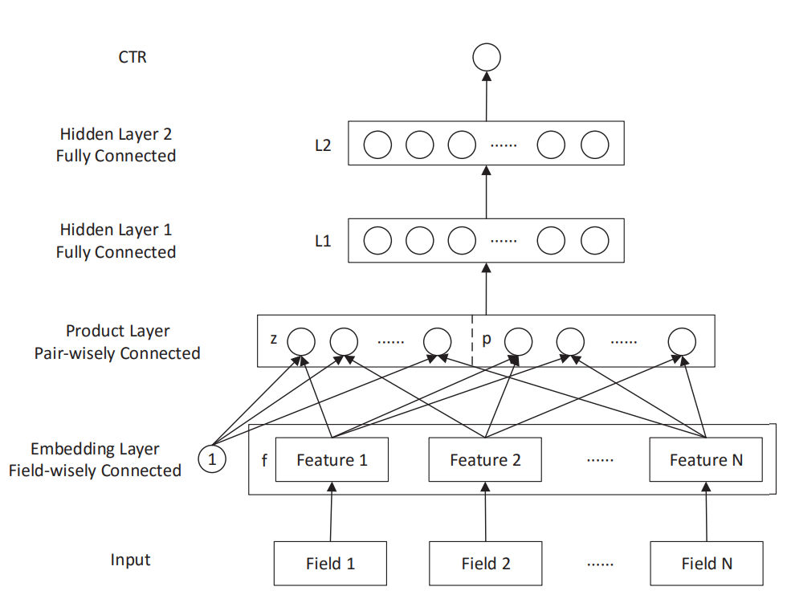

# PNN: Product-based Neural Network
2020/06/21

上海交大 & UCL\[ICDM 2016\][Product-based Neural Networks for User Response Prediction](https://arxiv.org/pdf/1611.00144.pdf) (ver. arXiv-v1)

## 前言

PNN和之前的FNN是同一批人的成果（Jun Wang, Weinan Zhang），因此PNN在模型上与FNN有一定的承接性。从特征交叉的角度来看，PNN中的IPNN代表了从FM沿袭下来的、以内积$v_i^Tv_j$或element-wise乘积（哈达玛积）形式为主的vector-wise特征交叉，即embedding向量的各个维度之间不发生乘积运算；而OPNN则跳出了这个思路，使用了外积$v_iv_j^T$形式为主的bit-wise特征交叉，即embedding向量的各个维度之间也需要乘积。

### 太长不看版总结

优点：开创性地基于向量外积计算提出了bit-wise的特征交叉方式，由于沿袭了FNN利用深度模型强化表征能力的思路，通过IPNN和OPNN的显式特征交叉进一步强化了这么做的效果。

缺点：无论是IPNN还是OPNN，其计算的时间复杂度和空间复杂度都偏高；且PNN并没有从根本上解决深度模型难以拟合特征交叉的问题，只是利用更好的显示交叉特征来弥补了这个弱点。

## 正文

### 动机

我们在paper的introduction部分找到了作者的动机：

> these models (指LR、GBDT和FM) highly depend on feature engineering in order to capture high-order latent patterns.
> The quality of embedding (指FNN) initialization is largely limited by the factorization machine. 
> More importantly, the “add” operations of the perceptron layer might not be useful to explore the interactions of categorical data in multiple fields. ... local dependencies between features from different fields can be effectively explored by feature vector “product” operations instead of “add” operations.

其中第一条和FNN的第一条一致，还是说明非深度的模型在对特征工程的依赖很高。而另两点则是相对更重要的：
1. FNN利用FM预训练得到的嵌入向量，其质量极大程度被FM限制了（简单来说就是觉得FM的表征能力不行）
2. 神经网络的线性部分（加和模型）在表达不同field之间的依赖关系时效果不如向量积的效率高（仅凭深度模型很难做到特征A“与”特征B的特征交叉，只能做到特征A+特征B的线性组合）

从动机来看，PNN认为仅凭深度模型很难做特征交叉，同时也指出，诸如Weekday=Tuesday“与”Gender=Male这样的特征交叉形式在推荐任务中是十分重要且高效的。

### 模型结构与pytorch实现

还是先来看看模型结构图：


<div style="text-align: center;">图1：PNN模型结构图</div>

按照惯例，我们还是从输出层开始往输入看。

输出是老样子sigmoid二分类输出（$\sigma$即sigmoid函数）：

$$ \hat{y}=\sigma(W_3l_2+b_3) \tag{1} $$

```python
# __init__
self.output_layer=OutputLayer(in_dim=l2_dim,out_type='binary')

# forward
y=self.output_layer(l2_out)
```

PNN的$l_2$和$l_1$层稍微有一些不一样，其中$l_1$层只用了ReLU激活而没有加权重。这里也可以用权重后移的方式把$l_z$和$l_p$的权重移动（把$z$和$p$展平然后拼接）到$l_1$层来。

$$ l2=relu(W_2l_1+b_2) \tag{2} $$
$$ l1=relu(l_z+l_p+b_1) \tag{3} $$

```python
# __init__
self.l2=nn.Linear(in_features=D1,out_features=l2_dim)
self.l1_bias=nn.Parameter(torch.zeros(D1))
nn.init.xavier_uniform_(self.l2.weight)
nn.init.xavier_uniform_(self.l1_bias.data)

# forward
l1_in=l_z+l_p+self.l1_bias
l1_out=nn.ReLU()(l1_in)
l2_out=self.l2(l1_out)
```

再往前就是特征交叉层了。特征交叉层分为两个部分，一个是一阶线性部分的$l_z$（称为linear signal），还有一个是二阶交叉的$l_p$。此处作者定义了张量内积运算$\odot$（实际上和reshape成一个向量以后内积是一样的）：

$$ A \odot B \triangleq \sum_{i,j}{A_{i,j}B_{i,j}} \tag{4} $$
$$ l_z=(l_z^1,l_z^2,...,l_z^{D_1}), l_z^n=W_z^n \odot z $$
$$ l_p=(l_p^1,l_p^2,...,l_p^{D_1}), l_p^n=W_p^n \odot p \tag{5} $$
$$ z=(z_1,z_2,...,z_N)\triangleq(f_1,f_2,...f_N) \tag{6} $$
$$ p=\{p_{i,j}\}, i=1...N, j=1...N \tag{7} $$

把这个$l_p$的部分拿掉，就能得到一个完整的FNN网络结构（不是

我们先跳掉线性信号$l_z$和特征交叉$l_p$，看Embedding，这个部分和FNN的一模一样：

$$ z_i=W_0^i \cdot x[{\rm start}_i : {\rm end}_i]=(w_i,v_i^1,v_i^2,...,v_i^K) \tag{8} $$

目标函数是分类任务经典交叉熵函数：

$$ L(y,\hat{y})=-y\log{\hat{y}}-(1-y)\log{1-\hat{y}} \tag{9} $$

回过头来我们来看这篇文章最重要的特征交叉层的pair-wisely connected是怎么做的。

首先是线性信号$l_z$部分：

$$ l_z^n=W_z^n \odot z=\sum_{i=1}^{N}{\sum_{j=1}^{M}{(W_z^n)_{i,j}z_{i,j}}} \tag{10}$$

```python
# __init__
self.linear_signal_weights = nn.Linear(in_features=num_fields * emb_dim, out_features=d1)
nn.init.xavier_uniform_(self.linear_signal_weights.weight)

# forward
concat_z = feat_emb.reshape(-1, self.emb_dim * self.num_fields)
linear_signal = self.linear_signal_weights(concat_z)
```

线性部分和FNN没什么太大的区别（换了一种高大上的说法）。接着我们来仔细看二阶交叉部分$l_p$。

#### Inner-product实现

在IPNN中，向量积使用了内积，即$v_i^Tv_j$。作者提出使用对称矩阵的一阶分解形式来简化向量积的复杂度：

$$ W_p^n \odot p = \sum_{i=1}^{N}{\sum_{j=1}^{N}{\theta_i^n\theta_j^n \langle f_i,f_j \rangle}}=\langle \sum_{i=1}^{N}{\delta_i^n},\sum_{i=1}^{N}{\delta_i^n}\rangle \tag{11}$$

其中，$ \delta_i^n=\theta_i^nf_i\in\mathbb{R}^M $

实际上作者给出的实现代码中并没有用到这一形式。用一阶分解的形式并不会让代码变得更简单，同时对每个神经元都需要计算二范式，导致没办法用矩阵计算一次性完成所有神经元上的操作，反而使得并行能力下降。在实现代码中，可以通过构造一个特征交叉序列来完成每一个$\langle f_i,f_j \rangle$（因为操作满足交换律，$p_{ij}=p_{ji}$，所以$p$是对称的）：

```python
row = []
col = []
for i in range(num_fields - 1):
    for j in range(i + 1, num_fields):
        row.append(i)
        col.append(j)
p = feat_emb[:, row]  # N * num_pairs * emb_dim
q = feat_emb[:, col]  # N * num_pairs * emb_dim
```

其中，row是特征交叉中的$f_i$，col是特征交叉中的$f_j$，通过一个二层循环构造出所有不重复的$i,j$对（一共$num\_pairs=num\_fields*(num\_fields-1)/2$个对），然后利用切片映射到$f_i$和$f_j$上，那么对p和q做element-wise积后对第二个维度（三个维度分别为0：batch_size，1：num_pairs，2：emb_dim）求和即可得到（7）式中的特征交叉内积矩阵$p$的展平形式。此时笔者使用了pytorch的Linear层来完成$l_p$的计算:

```python
# __init__
self.product_layer_weights = nn.Linear(in_features=self.num_pairs, out_features=d1)
nn.init.xavier_uniform_(self.product_layer_weights.weight)

# forward
pij = p * q  # N * num_pairs * emb_dim
pij = torch.sum(pij, dim=2)  # N * num_pairs
lp = self.product_layer_weights(pij)
```

#### Outer-product实现

外积就比内积要麻烦得多了，因为此时（7）式中的$p_{ij}$是一个$N\times N$的矩阵。所以此时权重矩阵（张量）的维度为$num\_fields\times num\_fields\times N\times N$。此处作者提出了element-wise的叠加方式来降低计算复杂度：

$$ p=\sum_{i=1}^{N}{\sum_{j=1}^{N}{f_if_j^T}}=f_\Sigma(f_\Sigma)^T, f_\Sigma=\sum_{i=1}^{N}{f_i} \tag{12}$$

然后这一次作者又没有用到这个公式（这个公式比上一个已经好很多了，相当容易用矩阵优化）。

我们先把$v_iv_j^T \odot W_{ij}$的结果用矩阵的形式表示出来(用$w$简记$W_{ij}\in\mathbb{R^{N\times N}}$)：

$$ v_iv_j^T \odot W_{ij}=A=
\left[
\begin{matrix}
w_{1,1}v_{i,1}v_{j,1} & w_{1,2}v_{i,1}v_{j,2} & ... & w_{1,N}v_{i,1}v_{j,N} \\
w_{2,1}v_{i,2}v_{j,1} & w_{2,2}v_{i,2}v_{j,2} & ... & w_{2,N}v_{i,2}v_{j,N} \\
... & ... & ... & ... \\
w_{N,1}v_{i,N}v_{j,1} & w_{N,2}v_{i,N}v_{j,2} & ... & w_{N,N}v_{i,N}v_{j,N}
\end{matrix}
\right]
\tag{13}
$$

如果把矩阵里所有的元素相加，我们可以先把每一列相加，再把每一行相加：

$$ \sum_{k=1}^{N}{\sum_{l=1}^{N}{A_{ij}}}=\sum_{l=1}^{N}{(\sum_{k=1}^{N}{w_{k,l}v_{i,k}})v_{j,l}} \tag{14} $$

每一列的计算，实际上是$W_{ij}$的每一列分别与$v_i$做内积（$w_l$为$W_{ij}$的第$l$列）（实际上是一个广播的element-wise乘积后求和）：

$$ \sum_{k=1}^{N}{w_{k,l}v_{i,k}}=\langle w_l,v_i\rangle \tag{15} $$

然后再把这个结果与$v_j$做内积:

$$ \sum_{l=1}^{N}{(\sum_{k=1}^{N}{w_{k,l}v_{i,k}})v_{j,l}}
=\sum_{l=1}^{N}{\langle w_l,v_i\rangle v_{j,l}} 
=\langle \langle W_{ij},v_i \rangle(broadcast),v_j\rangle
\tag{16} $$

其中，broadcast的内积是指：

$$ \langle W_{ij},v_i \rangle(broadcast)=(\langle W_{{ij}_1},v_i\rangle,\langle W_{{ij}_2},v_i\rangle,...,\langle W_{{ij}_N},v_i\rangle) \tag{17}$$

通过广播的内积可以得到长度为$N$的向量结果。

我们现在来把针对$p_{ij}$的计算扩展到$p$及带有batch_size的形式：

利用上一节中的展开形式，权重张量可以降到3个维度：(num_pairs,emb_dim,emb_dim)，同时能够构造出p和q都是(batch_size,num_pairs,emb_dim)的张量。这里的介绍根据PNN作者提供的代码不做任何改动，所以其实际权重张量的维度为(emb_dim,num_pairs,emb_dim)（而笔者倾向于直接根据计算的顺序进行维度变换，即(num_pairs,emb_dim,emb_dim)）。

p是(batch_size,num_pairs,emb_dim)张量，没有长度为1的维度，没有办法进行广播内积计算，所以需要unsqueeze添加一个维度，将其维度变成(batch_size,1,num_pairs,emb_dim)以进行广播内积。这里其实unsqueeze在哪个维度对后续的计算并没有什么影响，只需要与权重张量$W$的维度匹配，并在后续进行相应的调整即可。此处放在num_pairs前面是为了避免与后面的emb_dim混淆，此时第1个长度为emb_dim的维度代表广播内积计算后的结果向量维度，最后一个长度为emb_dim的维度代表了特征的embedding空间，因此内积操作后这个维度消失，得到(batch_size,emb_dim,num_pairs)。该维度的顺序与q不匹配，进行交换后再作element-wise乘积+求和（即内积）。


```python
# __init__
self.kernel = nn.Parameter(torch.zeros(emb_dim,num_pairs,emb_dim))
nn.init.xavier_uniform_(self.kernel.data)

# forward
p = p.unsqueeze(1)  # batch_size * 1 * num_pairs * emb_dim
p = p * self.kernel  # batch_size * emb_dim * num_pairs * emb_dim
kp = torch.sum(p, dim=-1)  # batch_size * emb_dim * num_pairs
kp = kp.permute(0, 2, 1)  # batch_size * num_pairs * emb_dim
pij = torch.sum(kp * q, -1)  # batch_size * num_pairs
```

作者在代码中提到了可以使用vector或是单个数值作为权重，对这种形式可以理解为：vector表示$W_{ij}$是一个由emb_dim个完全相同的行向量/列向量组成的矩阵，单个数值表示$W_{ij}$矩阵所有的元素为同一个数值。在计算形式上vector和数值也比矩阵要方便得多，可以直接进行三次element-wise乘积以后相加得到结果。

```python
# __init__
self.kernel = nn.Parameter(torch.zeros((num_pairs, emb_dim)))  # vector
# 或
self.kernel = nn.Parameter(torch.zeros((num_pairs, emb_dim)))  # 数值
nn.init.xavier_uniform_(self.kernel.data)

# forward
kernel = self.kernel.unsqueeze(1)  # 1 * num_pairs * emb_dim/1
pij = p * q  # N * num_pairs * emb_dim
pij = pij * kernel  # N * num_pairs * emb_dim
pij = torch.sum(pij, -1)  # N * num_pairs
```

此外，文中提及的PNN*实际上是$l_p$同时包含inner-product和outer-product两个部分。

整理一下这一段内容，我们设计并实现一个继承nn.Module的PNN类（model/ctr/pnn.py）（同样没有对多标签的字段进行处理）：

```python
import torch
import torch.nn as nn
from model.basic.mlp import MLP
from model.basic.output_layer import OutputLayer
from model.basic.functional import build_cross


class PNN(nn.Module):

    def __init__(self, emb_dim, feat_dim, num_fields, fc_dims=None, dropout=None, batch_norm=None,
                 product_type='inner', out_type='binary'):
        super(PNN, self).__init__()
        # embedding layer
        self.emb_dim = emb_dim
        self.feat_dim = feat_dim
        self.num_fields = num_fields
        self.emb_layer = nn.Embedding(num_embeddings=self.feat_dim,
                                      embedding_dim=self.emb_dim)
        nn.init.xavier_uniform_(self.emb_layer.weight)

        # linear signal layer, named l_z
        if not fc_dims:
            fc_dims = [32, 32]
        self.d1 = d1 = fc_dims[0]
        self.product_type = product_type
        if product_type == '*':
            d1 *= 2
        self.linear_signal_weights = nn.Linear(in_features=num_fields * emb_dim, out_features=d1)
        nn.init.xavier_uniform_(self.linear_signal_weights.weight)

        # product layer, named l_p
        if product_type == 'inner':
            self.product_layer = InnerProductLayer(num_fields, d1)
        elif product_type == 'outer':
            self.product_layer = OuterProductLayer(emb_dim, num_fields, d1)
        else:
            self.product_layer = HybridProductLayer(emb_dim, num_fields, d1)

        # fc layers
        # l_1=relu(l_z+l_p_b_1)
        self.l1_layer = nn.ReLU()
        self.l1_bias = nn.Parameter(torch.randn(d1))
        # l_2 to l_n
        self.fc_dims = fc_dims
        self.fc_layers = MLP(d1, self.fc_dims, dropout, batch_norm)

        # output layer
        self.output_layer = OutputLayer(fc_dims[-1], out_type)

    def forward(self, feat_index):
        # feat_index: N * num_fields
        feat_emb = self.emb_layer(feat_index)  # N * num_fields * emb_dim

        # compute linear signal l_z
        concat_z = feat_emb.reshape(-1, self.emb_dim * self.num_fields)
        linear_signal = self.linear_signal_weights(concat_z)

        # product_layer
        product_out = self.product_layer(feat_emb)

        # fc layers from l_2 to l_n
        # l_1=relu(l_z+l_p_b_1)
        l1_in = torch.add(linear_signal, self.l1_bias)
        l1_in = torch.add(l1_in, product_out)
        l1_out = self.l1_layer(l1_in)
        y = self.fc_layers(l1_out)
        y = self.output_layer(y)
        return y


class InnerProductLayer(nn.Module):
    def __init__(self, num_fields, d1):
        super(InnerProductLayer, self).__init__()
        self.num_fields = num_fields
        self.d1 = d1
        self.num_pairs = int(num_fields * (num_fields - 1) / 2)
        self.product_layer_weights = nn.Linear(in_features=self.num_pairs, out_features=d1)
        nn.init.xavier_uniform_(self.product_layer_weights.weight)

    def forward(self, feat_emb):
        # feat_emb: N * num_fields * emb_dim

        # p_ij=<f_i,f_j>
        # p is symmetric matrix, so only upper triangular matrix needs calculation (without diagonal)
        p, q = build_cross(self.num_fields, feat_emb)
        pij = p * q  # N * num_pairs * emb_dim
        pij = torch.sum(pij, dim=2)  # N * num_pairs

        # l_p
        lp = self.product_layer_weights(pij)
        return lp


class OuterProductLayer(nn.Module):
    def __init__(self, emb_dim, num_fields, d1, kernel_type='mat'):
        super(OuterProductLayer, self).__init__()
        self.emb_dim = emb_dim
        self.num_fields = num_fields
        self.d1 = d1
        self.num_pairs = num_fields * (num_fields - 1) / 2
        self.kernel_type = kernel_type
        if kernel_type == 'vec':
            kernel_shape = (self.num_pairs, emb_dim)
        elif kernel_type == 'num':
            kernel_shape = (self.num_pairs, 1)
        else:  # by default mat
            kernel_shape = (emb_dim, self.num_pairs, emb_dim)
        self.kernel_shape = kernel_shape
        self.kernel = nn.Parameter(torch.zeros(kernel_shape))
        nn.init.xavier_uniform_(self.kernel.data)
        self.num_pairs = num_fields * (num_fields - 1) / 2
        self.product_layer_weights = nn.Linear(in_features=num_fields, out_features=d1)
        nn.init.xavier_uniform_(self.product_layer_weights.weight)

    def forward(self, feat_emb):
        p, q = build_cross(self.num_fields, feat_emb)  # p, q: N * num_pairs * emb_dim

        if self.kernel_type == 'mat':
            # self.kernel: emb_dim * num_pairs * emb_dim
            p = p.unsqueeze(1)  # N * 1 * num_pairs * emb_dim
            p = p * self.kernel  # N * emb_dim * num_pairs * emb_dim
            kp = torch.sum(p, dim=-1)  # N * emb_dim * num_pairs
            kp = kp.permute(0, 2, 1)  # N * num_pairs * emb_dim
            pij = torch.sum(kp * q, -1)  # N * num_pairs
        else:
            # self.kernel: num_pairs * emb_dim/1
            kernel = self.kernel.unsqueeze(1)  # 1 * num_pairs * emb_dim/1
            pij = p * q  # N * num_pairs * emb_dim
            pij = pij * kernel  # N * num_pairs * emb_dim
            pij = torch.sum(pij, -1)  # N * num_pairs

        # l_p
        lp = self.product_layer_weights(pij)
        return lp


class HybridProductLayer(nn.Module):
    def __init__(self, emb_dim, num_fields, d1):
        super(HybridProductLayer, self).__init__()
        self.num_fields = num_fields
        self.d1 = d1 / 2
        self.inner_product_layer = InnerProductLayer(num_fields, d1)
        self.outer_product_layer = OuterProductLayer(emb_dim, num_fields, d1)

    def forward(self, feat_emb):
        inner_product_out = self.inner_product_layer(feat_emb)
        outer_product_out = self.outer_product_layer(feat_emb)
        lp = torch.cat([inner_product_out, outer_product_out], dim=1)
        return lp
```

### 模型分析

截取PNN的模型讨论部分(III.D)中的一段：

> Analogous to electronic circuit, addition acts like “OR” gate while multiplication acting like “AND” gate, and the product layer seems to learn rules other than features. Reviewing the scenario of computer vision, while pixels in images are real-world raw features, categorical data in web applications are artificial features with high levels and rich meanings. Logic is a powerful tool in dealing with concepts, domains and relationships.

简单翻译一下这段话：
1. 加和模型（深度模型）类似电路中的“或门”，而积（特征交叉）类似电路中的“与门”，因此积可以学到更多的规则而不是特征的权重。
2. 推荐系统所面对的数据与CV有很大的不同：推荐系统本身的类别特征已经富含了大量的人工特征和高级别的语意。
3. 逻辑很擅长处理概念、域和关系（应对高级别语意）。

PNN模型对交叉层（product layer）的看法是认为相比深度模型更擅长处理具有多个类别特征的数据，而且电路逻辑门的相关结论是PNN的主要贡献之一（不管是作者自己写的，还是从2020年往前看这个结论都是，可以说是从另一个角度解释了为什么特征交叉是必要的且优于深度模型）。另一方面，虽然PNN作者自己并没有提出，但是OPNN是一个bit-wise的特征交叉，其粒度比FM沿袭下来的vector-wise的特征交叉更细（笔者还是要说明更细粒度不代表更好，只是另一种不同的思路），这一思路的后续主要有DCN和xDeepFM。

模型泛化（好像从2016年开始，各种会议里充斥着“本文模型是对XXX的泛化，当xxx时即xxx模型”）：上一节中提到的，当product层不包含$l_p$时，PNN退化为FNN；另外，当IPNN的隐藏层深度为0时，退化为FM。

### 复现相关参数设置

数据集：Criteo-1TB，iPinYou season 2 & 3

优化器：SGD随机梯度下降

评价指标：AUC、RIG（Relative Information Gain）相对信息增益

Embedding维度：10

隐层深度：3（不包括product layer）

激活函数：ReLU

过拟合：dropout（未给出明确比率）；L2正则化。

其他：先使用FM预训练一个embedding，然后连接起来再继续训练微调。

paper中的实验结果：

Criteo数据集：

|model|AUC|RIG|
|:---|:---|:---|
|IPNN|77.79%|1.243e-1|
|OPNN|77.54%|1.211e-1|
|PNN*|77.00%|1.118e-1|

iPinYou数据集：

|model|AUC|RIG|
|:---|:---|:---|
|IPNN|79.14%|1.376e-1|
|OPNN|81.74%|1.349e-1|
|PNN*|76.61%|1.740e-1|