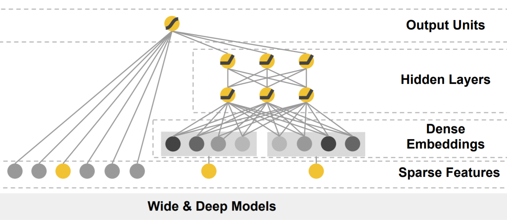

# Wide & Deep Network
2020/06/25

谷歌\[DLRS2016\][Wide & Deep Learning for Recommender Systems](https://dl.acm.org/doi/pdf/10.1145/2988450.2988454)(ver. acm)

## 前言

Wide & Deep Network算是谷歌的亲儿子了（16个作者全是谷歌的，这么多作者有点生物医学期刊的味道了），而论文的出发点也和前面的FNN、PNN稍有不一致：online serving。不论是论文里多次提及还有实验的服务延迟（serving latency），还是这种16个作者的4页短文，都表明了这是一篇出自且偏重工程实践的论文。Wide & Deep Network大概可以算是并联模型的始祖，一方面可能是由于并联模型的时间复杂度要低于串联模型（可以高度并行化）；另一方面，作者希望利用并联模型最后的加权和的形式，用特征交叉的记忆能力平衡深度模型的过度泛化问题。

由于是4页短文，所以有些模型的细节以及实验部分的信息并没有在文中提供，因此本文最后复现相关参数设定这一小节的内容将会很不详细。

### 太长不看版总结

优点：提出了特征交叉与深度模型并联的模型结构，利用加权和制衡模型的记忆能力和过度泛化问题；从工程实践角度看，模型具有很好的并行化能力，能够提供低延迟的线上服务；（既是优点也是缺点）能够利用早期LR模型经验，将已经优化好的人工特征交叉数据直接迁移到本模型上。

缺点：（对于没有早期LR模型经验）特征交叉部分依赖人工选择要交叉的特征，且采用了特征的累乘进行交叉（即一组要交叉的0，1二值特征乘起来，必须所有特征都出现结果才为1），故其不能像FM这样通过embedding构造在数据集中没有出现过的特征交叉形式。

## 正文

### 动机

按照惯例，我们还是先找论文的动机，在abstract和introduction部分都有提到（此处节选自abstract）：

>  Memorization of feature interactions through a wide set of cross-product feature transformations are effective and interpretable, while generalization requires more feature engineering effort. With less feature engineering, deep neural networks can generalize better to unseen feature combinations through low-dimensional dense embeddings learned for the sparse features. 
> However, deep neural networks with embeddings can over-generalize and recommend less relevant items when the user-item interactions are sparse and high-rank. ... to combine the benefits of memorization and generalization for recommender systems

论点还是相对清晰的：
1. 特征交叉代表了对特征交互的记忆，具有良好的效率和可解释性，而泛化需要大量的特征工程。
2. 带有embedding的深度模型不需要很多特征工程就能达到良好的繁华效果，但很容易过度泛化推荐结果。
3. 需要结合记忆能力和泛化能力的优点进行推荐。

从作者的论述来看，他认为特征交叉所代表的记忆能力和深度模型代表的泛化能力是相辅相成的，这也是作者使用并联模型的一大原因：使用加法结合优点，使用权重制衡缺点（局限在出现过的交叉、过度泛化）。

### 模型结构与pytorch实现

Wide & Deep Network的模型结构就相当简单了，本质上就是并联一个MLP和一个LR模型：



#### Wide Network

首先是Wide网络部分，是由原始特征和交叉特征组成的LR模型：

$$ y=w^Tx+b \tag{1} $$
$$ \phi_k(x)=\prod_{i=1}^{d}{x_i^{c_ki}},c_ki\in\{0,1\} \tag{2} $$

实际上这部分应该在预处理的时候就完成交叉特征的计算了，因为对于CTR预估类的任务，作为参数传入大量的0是没有意义的，一般都会将高维稀疏特征转换成特征编号列表(feat_index)，只记录值为1的特征的下标。

此处笔者在计算时，直接计算了最后输出部分的$w_wide^T[x,\phi(x)]+b$

```python
# __init__
self.cate_weights = nn.Embedding(num_embeddings=num_feats - num_cont_fields, embedding_dim=1)
self.cont_weights = nn.Linear(in_features=num_cont_fields, out_features=1)
self.wide_bias = nn.Parameter(torch.randn(1))
nn.init.xavier_uniform_(self.cate_weights.weight)
nn.init.xavier_uniform_(self.cont_weights)

# forward
first_order_cate = self.cate_weights(categorical_index)
first_order_cont = self.cont_weights(continuous_value)
y_wide = first_order_cate + first_order_cont + self.wide_bias
```

#### Deep Network

然后是Deep网络的部分，是一个MLP模型：

$$ a^{(l+1)}=f(W^{(l)}a^{(l)}+b^{(l)}) \tag{3} $$

此处笔者在计算时，往深度网络最后加了一层1个神经元的全连接层，相当于直接计算了最后输出层的$w_deep^Ta^{(lf)}$（这里最后一层也有bias，相当于最后输出层的bias由wide和deep部分相加得到，对结果没有影响）

```python
# __init__
fc_dims.append(1)
self.fc_dims = fc_dims
self.emb_layer = nn.Embedding(num_embeddings=num_feats - num_cont_fields, embedding_dim=emb_dim)
nn.init.xavier_uniform_(self.emb_layer.weight)
self.deep = MLP(num_cont_fields + num_cate_fields * emb_dim, fc_dims, dropout, batch_norm)

# forward
cate_emb_value = self.emb_layer(categorical_index)  # N * num_cate_fields * emb_dim
cate_emb_value = cate_emb_value.reshape((-1, self.num_cate_fields * self.emb_dim))  # N * (num_cate_fields * emb_dim)
deep_in = torch.cat([continuous_value, cate_emb_value], 1)  # N * (num_cate_fields * emb_dim + num_cont_fields)
y_deep = self.deep(deep_in)  # N * 1
```

最后是输出部分：

$$ P(Y=1|x)=\sigma(w_wide^T[x,\phi(x)]+w_deep^Ta^{(lf)}+b) \tag{4} $$

因为这里wide和deep网络的输出都已经经过加权计算了，因此只需要加起来经过一个Sigmoid就可以了。

```python
# __init__
self.output_layer=OutputLayer(in_dim=1, out_type=out_type)

# forward
y = y_deep + y_wide
y = self.out_layer(y)
```

最后整理得到的（model/ctr/wide_and_deep.py）：

```python
import torch
import torch.nn as nn

from model.basic.output_layer import OutputLayer
from model.basic.mlp import MLP


class WideAndDeep(nn.Module):
    def __init__(self, emb_dim, num_feats, num_cate_fields, num_cont_fields, num_cross_feats, fc_dims=None,
                 dropout=None,
                 batch_norm=None, out_type='binary'):
        super(WideAndDeep, self).__init__()
        self.emb_dim = emb_dim
        self.num_feats = num_feats
        self.num_cate_fields = num_cate_fields
        self.num_cont_fields = num_cont_fields
        self.num_cross_feats = num_cross_feats

        # first order weight for category features
        self.cate_weights = nn.Embedding(num_embeddings=num_feats - num_cont_fields, embedding_dim=1)
        nn.init.xavier_uniform_(self.cate_weights.weight)

        # first order weight for continuous features
        self.cont_weights = nn.Linear(in_features=num_cont_fields, out_features=1)
        nn.init.xavier_uniform_(self.cont_weights)

        self.wide_bias = nn.Parameter(torch.randn(1))

        if not fc_dims:
            fc_dims = [32, 32]
        fc_dims.append(1)
        self.fc_dims = fc_dims

        # embedding for deep network
        self.emb_layer = nn.Embedding(num_embeddings=num_feats - num_cont_fields, embedding_dim=emb_dim)
        nn.init.xavier_uniform_(self.emb_layer.weight)

        self.deep = MLP(num_cont_fields + num_cate_fields * emb_dim, fc_dims, dropout, batch_norm)
        self.out_layer = OutputLayer(in_dim=1, out_type=out_type)

    def forward(self, continuous_value, categorical_index, cross_feat_index):
        first_order_cate = self.cate_weights(categorical_index)
        first_order_cont = self.cont_weights(continuous_value)
        y_wide = first_order_cate + first_order_cont + self.wide_bias

        cate_emb_value = self.emb_layer(categorical_index)  # N * num_cate_fields * emb_dim
        # N * (num_cate_fields * emb_dim)
        cate_emb_value = cate_emb_value.reshape((-1, self.num_cate_fields * self.emb_dim))
        deep_in = torch.cat([continuous_value, cate_emb_value], 1)  # N * (num_cate_fields * emb_dim + num_cont_fields)
        y_deep = self.deep(deep_in)  # N * 1
        y = y_deep + y_wide
        y = self.out_layer(y)
        return y

```

### 模型分析

首先是连续特征处理方面，Wide & Deep Network和同年的FNN、PNN选择了不同的处理方式。

对连续特征的处理方法主要有3种形式：
1. 离散化后当成类别特征处理
2. 对特征嵌入以后乘上连续特征的值（$v_ix_i$）
3. 将连续特征直接拼接到嵌入后的类别特征后

Wide & Deep Network选择的是第3种，当然这3种方法到底哪一种更好也没有明确的定论，只能说是对于谷歌面对的数据可能第3种更好。

然后我们来说说这个网络结构的部分。

对于Wide网络来说，交叉积变换其实就是早期LR模型里的人工特征交叉，所以Wide & Deep Network其实并没有对特征交叉的部分提供什么创新点。但这一点在工程实践的线上服务特别重要：线上推荐服务的迭代并不是一蹴而就的，直接切换到全新的模型将需要大量的A/B测试时间。因此，Wide & Deep Network为还在使用人工特征交叉+LR模型的公司提供了很好的直接向深度模型进化的方法。

对于Wide和Deep并联结构，其最大的作用是“相互制衡”。从abstract、introduction和conclusion中对wide linear model和deep neural networks的相关描述，笔者先对特征交叉和深度模型的优缺点进行一下总结：

特征交叉（交叉积特征）使用的是人工选择特征进行交叉的方式，因此，其所谓的“记忆能力”主要来自于两点：一是乘积操作保证了必须所有特征值都为1时，交叉特征才为1，除了最后的权重需要学习外，不需要任何其他的参数就能够学到一条规则；二是人工选择的交叉必须依赖数据集中已经出现过的特征交叉形式，所以建立这样的规则能够“记住”数据集中出现过的特征交叉形式。而“记忆能力”的两个优点同时也是其缺陷：极大地依赖人工特征工程的质量；模型很难泛化，难以考虑未出现过的交叉形式。

而深度模型的优缺点则正好与特征交叉相反。带有embedding的深度神经网络不需要样本在数据集中出现也能进行计算和预测，不需要很多特征工程就能达到良好的泛化能力。而过度泛化的主要原因来自于embedding这个部分：在高维稀疏的样本集中，很难有效地学习到低维嵌入向量，尤其是出现次数很少的特征。另一方面，对于没出现过的特征交互，由于embedding向量总是能够生成非零的预测结果，所以会出现很多完全不相关推荐结果。

并联结构提供了一种加权和的数学计算形式，从形式上看对特征交叉部分和深度模型部分分别赋予了一个权重(即使在形式上不进行加权，实际上也相当于对两个部分分别加了0.5权重)，这个权重能够调节这两个部分在最终预测结果中的重要程度。由于上面所说的，特征交叉和深度模型的优点其实都是双刃剑，加权和把最终预测结果的“权力”分散到了两个部分，大幅降低了两者优点所带来的负面效果，使两种结构能够做到“相辅相成”。

### 复现相关参数设定

由于没有明确的数据集（文中给出的是为期3周的线上A/B测试），文中也没有对模型结构的具体超参数进行描述，因此没有相关参数设定（不能在同一条件下复现，且复现结果极易受到交叉特征选择的影响）。

训练&优化：最小批随机梯度下降；Wide——带L1正则的FTRL，Deep——AdaGrad。
