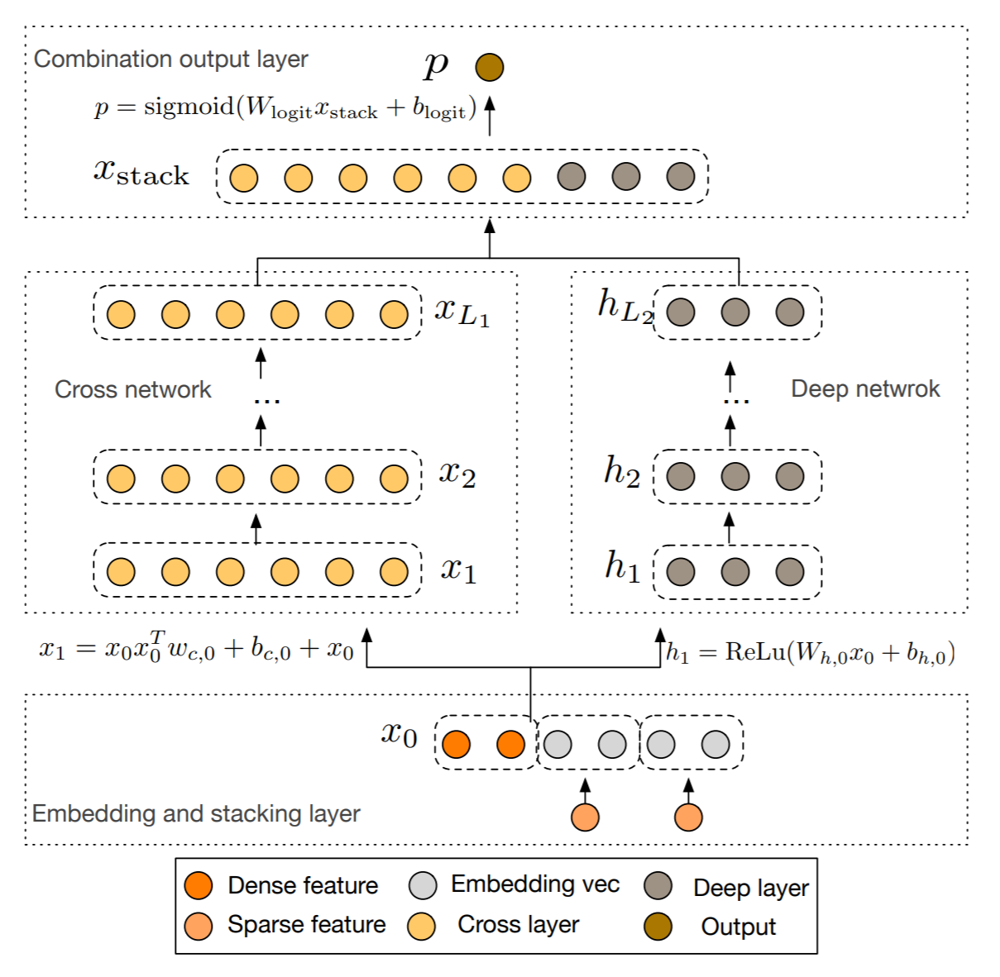

# DCN: Deep & Cross Network
2020/06/30

斯坦福大学 & 谷歌\[KDD 2017\][Deep & Cross Network for Ad Click Predictions](https://dl.acm.org/doi/pdf/10.1145/3124749.3124754) (ver. KDD)

## 前言

DCN是笔者觉得有点尴尬的一个模型，虽然出身斯坦福和谷歌两个大家，但实验部分写的可以说是很糟糕了，而且做实验的时候一不当心他就过拟合了。但DCN还是很有价值的一篇paper，其cross网络的多次bit-wise特征交叉构造高阶特征的思路可以说是首创，并在附录部分给出了详细的使用cross网络拟合多项式（高阶特征交叉）的理论推导。在paper的最后甚至表明DCN在非CTR的跨界任务中有优秀的表现（与DNNs对比）。另一方面，这篇paper延续了Wide & Deep Network偏重实践的风格，在实验部分给出了大量具有实践指导意义的超参数、优化器和预处理选择方法作为参考。

### 太长不看版结论

优点：通过在cross网络中对特征进行多次的bit-wise交叉构造出高阶交叉特征，且由于$x_0x_l^T$结果矩阵秩为1，cross网络的空间复杂度随层数增加仅线性增长；使用cross网络与deep网络共享输入、共同训练的方式，模型能够自动进行特征交叉。

缺点：cross网络极其容易过拟合，深度不宜超过6。

## 正文

### 动机

paper的动机在abstract部分开头两句就能找到：

> the process(指feature engineering) is nontrivial and often requires manual feature engineering or exhaustive searching
>
> they(指DNNs) generate all the interactions implicitly, and are not necessarily efficient in learning all types of cross features.

这两点动机简单明了：
1. 特征工程复杂度很高，要消耗大量的人力，所以要用DNN with embedding来做自动特征工程
2. DNN只能生成隐式的交互，在学习特征交叉时效率很低，因此需要显式的特征交叉来辅助DNN进行预测

### 模型结构与pytorch实现

还是先放一张模型结构图



最开始的embedding & stacking层，$x_0$即输入部分延续了Wide & Deep Network的“连续特征拼接在类别特征embedding后面”的做法：

$$ x_{embed,i}=W_{embed,i}x_i \tag{1} $$
$$ x_0=[x_{embed,1}^T,...,x_{embed,i}^T,x_{dense}^T] \tag{2} $$

这里按照原文的意思每个类别的嵌入向量是不等长的，其长度为$6\times (\rm category \, cardinality)^{1/4}$，这一部分将在后续的DeepRec-torch中实现，这里先放一个所有类别嵌入向量是等长的版本。

```python
# __init__
self.emb_layer = nn.Embedding(num_embeddings=num_feats - num_cont_fields, embedding_dim=emb_dim)
nn.init.xavier_uniform_(self.emb_layer.weight)

# forward
cate_emb_value = self.emb_layer(categorical_index)  # N * num_cate_fields * emb_dim
cate_emb_value = cate_emb_value.reshape((-1, self.num_cate_fields * self.emb_dim))  # N * (num_cate_fields * emb_dim)
x0 = torch.cat([continuous_value, cate_emb_value], 1)
```

#### Cross Network

Cross网络部分采用了DC模型的residual思想（实际上ResNet好像也是微软提出来的？），并且是bit-wise的特征交叉，即$x_0$的每个维度与$x_l$的所有维度都进行了计算。

$$ x_{l+1}=x_0x_l^Tw_l+b_l+x_l \tag{3} $$

这一部分和[PNN](/rec/feat-crossross/PNN.md)中以vector作为OPNN的权重核时完全一致，在每一次计算cross层时，特征交叉的阶数增加1阶。另外，在计算公式中的最后一项$x_l$是残差项，当传递到最后一层时，残差项的值为$x_1+x_2+...+x_l$，即权重$w_l$和偏置项$b_l$实际拟合的是$x_{l+1}-x_l$。

paper中提到由于$x_0x_l^T$的结果矩阵秩为1，所以不需要把整个矩阵都计算出来，可以大幅度节约时间和空间成本。这里笔者觉得不是只要进行一次结合律就可以变成向量数乘了吗（不是

$$ x_0x_l^Tw_l=x_0(x_l^Tw_l)=\langle x_l,w_l \rangle x_0 \tag{4} $$

在实现的过程中除了使用结合律先计算内积以外，笔者使用一个CrossLayer类将每一次cross计算抽象出来，以提高模块化程度（不直接将整个cross网络作为一个模块是想让每一层单独做好其初始化工作，而不用再使用循环去逐个初始化每一层的参数）。

```python
# __init__ in DCN
x0_dim = num_cont_fields + num_cate_fields * emb_dim
cross_layers = []
for _ in range(cross_depth):
    cross_layers.append(CrossLayer(x0_dim))
self.cross = nn.ModuleList(cross_layers)

# forward in DCN
xi = x0
for cross_layer in self.cross_depth:
    xi = cross_layer(x0, xi)

# __init__ in CrossLayer
self.weights = nn.Parameter(torch.zeros(x_dim, 1))  # x_dim * 1
nn.init.xavier_uniform_(self.weights.data)
self.bias = nn.Parameter(torch.randn(x_dim))  # x_dim

# forward in CrossLayer
x = torch.mul(xi, self.weights)  # N * x_dim
x = torch.sum(x, dim=1)  # N
x = x.unsqueeze(dim=1)  # N * 1
x = torch.mul(x, x0)  # N * x_dim
x = x + self.bias + xi
```

#### Deep Network

深度网络依然是一个直接调用的MLP模块。与Wide & Deep Network稍有不同的是，这次没有在MLP最后加一个单独的神经元来将最后的加权计算前置。

$$ h_{l+1}=f(W_lh_l+b_l) \tag{5} $$

```python
# __init__
self.deep = MLP(x0_dim, fc_dims, dropout, batch_norm)

# forward
y_dnn = self.deep(x0)
```

最后的输出部分也是直接调用的OutputLayer模块：

$$ p=\sigma([x_(L_1)^T,h_{L_2}^T]w_{logits}) \tag{6} $$

```python
# __init__
self.out_layer = OutputLayer(in_dim=fc_dims[-1] + x0_dim, out_type=out_type)

# forward
output = torch.cat([y_dnn, xi], dim=1)
output = self.out_layer(output)
```

最后整理一下得到完整的实现代码（model/ctr/dcn.py）：

```python
import torch
import torch.nn as nn
from model.basic.mlp import MLP
from model.basic.output_layer import OutputLayer
from model.basic.functional import bi_interaction


class DCN(nn.Module):
    def __init__(self, emb_dim, num_feats, num_cate_fields, num_cont_fields, cross_depth, fc_dims=None,
                 dropout=None, batch_norm=None, out_type='binary'):
        super(DCN, self).__init__()
        self.emb_dim = emb_dim
        self.num_feats = num_feats
        self.num_cate_fields = num_cate_fields
        self.num_cont_fields = num_cont_fields

        self.cross_depth = cross_depth
        # embedding for category features
        self.emb_layer = nn.Embedding(num_embeddings=num_feats - num_cont_fields, embedding_dim=emb_dim)
        nn.init.xavier_uniform_(self.emb_layer.weight)

        # deep network
        if not fc_dims:
            fc_dims = [32, 32]
        self.fc_dims = fc_dims
        x0_dim = num_cont_fields + num_cate_fields * emb_dim
        self.deep = MLP(x0_dim, fc_dims, dropout, batch_norm)

        # cross network
        cross_layers = []
        for _ in range(cross_depth):
            cross_layers.append(CrossLayer(x0_dim))
        self.cross = nn.ModuleList(cross_layers)

        self.out_layer = OutputLayer(in_dim=fc_dims[-1] + x0_dim, out_type=out_type)

    def forward(self, continuous_value, categorical_index):
        cate_emb_value = self.emb_layer(categorical_index)  # N * num_cate_fields * emb_dim
        # N * (num_cate_fields * emb_dim)
        cate_emb_value = cate_emb_value.reshape((-1, self.num_cate_fields * self.emb_dim))
        x0 = torch.cat([continuous_value, cate_emb_value], 1)

        y_dnn = self.deep(x0)

        xi = x0
        for cross_layer in self.cross_depth:
            xi = cross_layer(x0, xi)

        output = torch.cat([y_dnn, xi], dim=1)
        output = self.out_layer(output)
        return output


class CrossLayer(nn.Module):
    def __init__(self, x_dim):
        super(CrossLayer, self).__init__()
        self.x_dim = x_dim
        self.weights = nn.Parameter(torch.zeros(x_dim, 1))  # x_dim * 1
        nn.init.xavier_uniform_(self.weights.data)
        self.bias = nn.Parameter(torch.randn(x_dim))  # x_dim

    def forward(self, x0, xi):
        # x0,x1: N * x_dim
        x = torch.mul(xi, self.weights)  # N * x_dim
        x = torch.sum(x, dim=1)  # N
        x = x.unsqueeze(dim=1)  # N * 1
        x = torch.mul(x, x0)  # N * x_dim
        x = x + self.bias + xi
        return x
```

### 模型分析

先截取一段conclusion中paper对自己模型的描述：

> Deep & Cross Network proposed in this paper can handle a large set of sparse and dense features, and learns explicit cross features of bounded degree jointly with traditional deep representations.

从模型结合其动机来看，可以说DCN很好地解决了它想要解决的两个问题：自动特征工程&高效率的特征交叉。而实际上DCN模型提供了更多值得研究的细节。

关于DCN的模型训练，不同于Wide & Deep Network中Wide和Deep部分分开训练的方式，DCN和同年的DeepFM一样用了同一embedding输入两个网络+两个网络联合训练的方式，paper中给出的解释是：

> We jointly train both networks, as this allows each individual network to be aware of the others during the training.

对于这个“be aware of the others”，笔者在前一篇[DeepFM](/rec/feat-crossross/DeepFM.md)模型的分析中做过一定的分析：

> 回到DeepFM模型上来。DeepFM的并联模型相比Wide & Deep Network，使用了同一组embedding作为两个部分的输入，这使得Wide & Deep Network的“相互制衡”策略在DeepFM中得到了升级，在BP更新embedding的时候，FM部分和MLP部分能够“相互学习”：FM模型保持了embedding中的隐式二阶特征交叉信息（交叉特征权重=两个特征的嵌入向量内积），而MLP强化了embedding的泛化能力。

对DCN来说，共同学习的作用应该和DeepFM是相近的，同样沿袭了Wide & Deep Network的制衡策略，并在embedding更新时同时获取两个网络的梯度，使embedding的结果最终能够契合两个网络的特性（达到最佳平衡点）。

paper中3.2提到了FM的泛化（但paper并没有说DCN是FM的泛化）。DCN与FM的相同点在于他们都是每个特征都是独立学习的，并且交叉特征的权重是通过这些特征的相应参数组合得到的（参数分享思想，一个权重同时受到多组参数的共同影响，使模型训练更高效、能够泛化到训练数据中没有/极少出现的特征组合形式，但同时也是导致梯度耦合的根源所在）；不同点在于，FM是一个浅层模型，受到其二阶特征交叉的表征能力限制，而DCN能够构造$|\alpha|$阶内的所有特征交叉形式，将参数分享思想扩展到多层的形式。

关于paper附录中对cross网络拟合特征交叉的证明部分将会在理论研究板块的“深度模型与特征交叉”篇中进行详细的研究和讨论，在此就不做细节说明了（理论部分可参考Learning polynomials with neural networks）。另外，DCN对“ DNNs are able to approximate an arbitrary function under certain smoothness assumptions to an arbitrary accuracy, given suciently many hidden units or hidden layers.”的说明是：

> The features learned by DNNs, on the other hand, are implicit and highly nonlinear. Œis has shed light on designing a model that is able to learn bounded-degree feature interactions more eciently and explicitly than a universal DNN.

DNNs可能可以，但并不是最高效的。

比较奇怪的是DCN最后的实验部分只有LogLoss这一个指标，显然LogLoss并不是一个很有说服力的指标，因为其本质上只能反映模型拟合数据的能力而非模型在实际任务上的性能。另一方面，用于对比的5个基准线模型也没有很高的对比价值：LR和FM已经是比较老的模型了；DNN也只是DCN模型的一个部分；DC本质上是DSSM模型的延续，DCN只是借鉴了其在MLP上使用residual结构的思路，从特征交叉思路上看完全不一致；而Wide & Deep只是提到了但没有任何实验结果。虽然在描述Criteo数据集时提到了即使是0.001的LogLoss提升也能看作是巨大的实际提升，但最终DCN也只比基准线中最好的DC高了0.006（作者说是大幅度提升）。总体上笔者认为这篇paper的**实验部分**没有太强的说服力。

还有一个很奇怪的是，在实验部分的最后4.5节，作者表明DCN在两个UCI库中的两个非CTR预估任务：森林覆盖率和Higgs上均取得了优秀的结果（超过DNN）。

### 复现相关参数设置

数据集：Criteo-11GB

嵌入维度：$6\times (\rm category \, cardinality)^{1/4}$，Criteo嵌入总维度1026

预处理：连续型数值使用log变换

优化器：Adam优化器

batch size：512

其他优化参数：使用batchnorm批归一化；梯度阶段设置为100

正则化：于150000步后早停（奇怪的是正文中的目标函数中带有L2正则项）

超参数网格搜索范围：

|超参数名称|范围|
|:---|:---|
|MLP层数|2-5|
|MLP单元数|32-1024|
|Cross网络层数|1-6|
|初始学习率|0.0001-0.001步长0.0001|

paper中的实验结果：

LogLoss：0.4419

达到指定LogLoss需要的参数量：

|LogLoss|参数量|
|:---|:---|
|0.4430|$7.9\times 10^5$|
|0.4460|$7.3\times 10^4$|
|0.4470|$3.7\times 10^4$|
|0.4480|$3.7\times 10^4$|

在不同参数量下的LogLoss：

|参数量|LogLoss|
|:---|:---|
|$5\times 10^4$|0.4465|
|$1\times 10^5$|0.4453|
|$4\times 10^5$|0.4432|
|$1.1\times 10^6$|0.4426|
|$2.5\times 10^6$|0.4423|