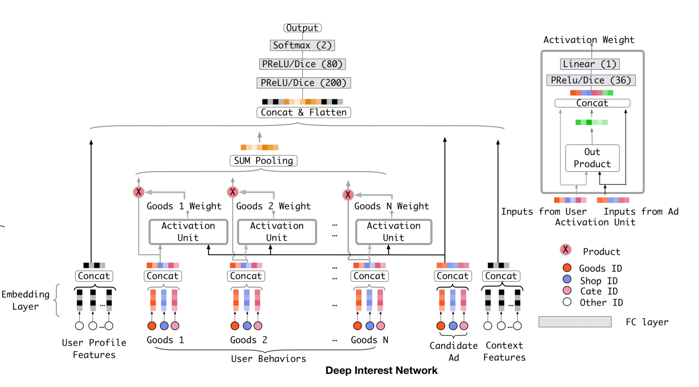

# DIN: Deep Interest Network
2020/07/26

阿里巴巴\[KDD2018\][Deep Interest Network for Click-Through Rate Prediction](https://arxiv.org/pdf/1706.06978.pdf) (ver. arXiv-v4，同KDD版本)

## 前言

距离DIN正式发布已经过去快两年了（事实上arXiv上的第一版发布于2017年6月21日，距今已经3年了），在此期间阿里巴巴陆陆续续在各家顶会中发布了多个不同类型的推荐模型，DIN也逐步更新到DIEN和DISN（虽然笔者觉得后两者和DIN的结构相似之处颇少）。DIN本质上是一篇工程型的paper：从模型角度上来看，DIN使用了attention池化，在2018年并不是一个创新性很强的模型结构（在2017的v1版本上就提出了类似attention的结构，在后期才改为attention）；而作为非结构部分的模型细节，包括mini-batch aware正则化以及自适应激活函数Dice（类似BN），都透露出一股浓重的实践气息，这才是这篇paper最为出彩的地方。

### 太长不看版结论

优点：使用attention机制强化/削弱用户商品序列中与候选广告相关/不相关的商品，实现对不同的候选广告，用户特征的表示不同，并通过不进行注意力信号值的归一化实现对用户与候选广告之间整体相关性的衡量；提出了在亿级数据量下的训练策略MBA（AUC绝对值比dropout高0.31%）与Dice激活函数（AUC绝对值比PReLU高0.15%）

缺点：使用池化的方式不关心序列内部的顺序，使序列顺序信息在处理过程中丢失（其进化版DIEN使用RNN-based模型解决了这一问题）

## 正文

### 动机

abstract中对动机的描述是这样的：

> In this way (指Embedding&MLP类的模型), user features are compressed into a fixed-length representation vector, in regardless of what candidate ads are. The use of fixed-length vector will be a bottleneck, which brings difficulty for Embedding&MLP methods to capture user’s diverse interests effectively from rich historical behaviors.

这里的描述比较模糊。根据introduction中第3、4段的相关细节描述，笔者对这一问题做一下补充说明：
1. 此处所说的fixed-length representation vector，并不是指如FM、DeepFM这样的dense embedding vector，而是embedding后通过运算（如PNN的product层、NFM的bi-interaction层或是简单的将多个特征拼接起来）得到的中间结果，如果将串联结构的MLP视作binary分类器的话，那么这个fixed-length vector就是MLP的输入；对于并联结构也是类似。
2. 根据1我们可以导出上述问题的核心所在：即对于同一个user，无论在模型中的candidate是哪一个商品/广告/etc，这个user特征永远是不变的，而这个特征是根据用户的所有交互记录决定的（在模型分析部分有一个比较详细的推论（但不一定十分严谨））。
3. 根据2则可以导出这个问题在商品/广告推荐中导致瓶颈的原因：当我们要向一个女性游泳者推荐护目镜时，我们应当根据她的商品交互记录中的游泳衣，而不是鞋子来进行推荐（例子使用introduction中的原例）。即对于不同的候选商品/广告，一个历史记录序列中的同一个物品应当会发挥不同的作用，这一点是1、2中所描述的fixed-length representation vector所无法完成的。

当然还有两个重要的训练优化技巧也有说明：

> Besides, we develop two techniques: mini-batch aware regularization and data adaptive activation function (指Dice) which can help training industrial deep networks with hundreds of millions of parameters.

其中，MBA正则化只对mini-batch中更新过的参数进行正则化计算，大幅减少了计算量；而Dice则基本类似BN的计算过程，能够使模型更快地收敛。

### 模型结构与pytorch实现

先放上一张模型图：



embedding部分图中省略了，实际上也是按照一般的思路来做的，其中所有的字段都是id类型，因此只需要考虑单值和多值两种情况。单值特征依旧是对每个值作embedding，多值特征采用了pooling的处理方法，具体是和还是平均池化文中没有具体说。embedding部分由于涉及到序列样本的构造，因此没有集成到模型中，见([model/basic/embedding_layer.py](https://github.com/zeroized/DeepRec-torch/blob/master/model/basic/embedding_layer.py))

然后根据模型结构图右侧的激活单元的结构图，我们得到了激活单元的实现（其中的out product部分，对DIN的公开源码进行查询后确认是$v_i * v_j$的计算方式）：

```python
class ActivationUnit(nn.Module):
    def __init__(self, g_emb_dim, linear_dim=36, activation='dice'):
        super(ActivationUnit, self).__init__()
        self.g_emb_dim = g_emb_dim
        if activation == 'dice':
            self.activation = Dice()
        else:
            self.activation = nn.PReLU()
        self.linear = nn.Linear(in_features=3 * g_emb_dim, out_features=linear_dim)
        self.out = nn.Linear(in_features=linear_dim, out_features=1)

    def forward(self, history_feat, candidate_feat):
        # history_feat: N * g_emb_dim
        # candidate_feat: N * g_emb_dim

        # There is no definition for "out product" in the activation unit, so here we use K * Q instead as many
        # other implementations do.
        out_product = torch.mul(history_feat, candidate_feat)  # N * g_emb_dim
        linear_in = torch.cat([history_feat, out_product, candidate_feat], dim=1)  # N * (3 * g_emb_dim)
        linear_out = self.linear(linear_in)
        out = self.activation(linear_out)
        return self.out(out)  # N * 1
```

其中，Dice激活函数起到了类似BN的归一化作用，其形式如下:

$$ f(s)=p(s) \cdot s+(1-p(s))\cdot \alpha s \tag{1} $$
$$ p(s)=\frac{1}{1+e^{-\frac{s-E[s]}{\sqrt{Var[s]+\epsilon}}}}$$

```python
class Dice(nn.Module):
    def __init__(self, epsilon=1e-3):
        super(Dice, self).__init__()
        self.epsilon = epsilon
        self.alpha = nn.Parameter(torch.randn(1))

    def forward(self, x: torch.Tensor):
        # x: N * num_neurons

        avg = x.mean(dim=1)  # N
        avg = avg.unsqueeze(dim=1)  # N * 1
        var = torch.pow(x - avg, 2) + self.epsilon  # N * num_neurons
        var = var.sum(dim=1).unsqueeze(dim=1)  # N * 1

        ps = (x - avg) / torch.sqrt(var)  # N * 1

        ps = nn.Sigmoid()(ps)  # N * 1
        return ps * x + (1 - ps) * self.alpha * x
```

注意力和池化部分需要对序列中的每个元素计算一个注意力信号值，此处笔者没有发现太好的使用矩阵优化计算过程的方法，因此使用了一个循环逐项计算注意力值：

```python
# __init__
self.activation_unit = ActivationUnit(g_emb_dim, activation_linear_dim, activation)

# forward
histories = torch.split(history_feats, 1, dim=1)  # [N * g_emb_dim] * seq_length
att_signals = [
    self.activation_unit(history_feat.squeeze(), candidate_feat)  # N * 1
    for history_feat in histories  # N * g_emb_dim
]
att_signal = torch.cat(att_signals, dim=1)  # N * seq_length
att_signal = att_signal.unsqueeze(dim=2)  # N * seq_length * 1
weighted = torch.mul(att_signal, history_feats)  # N * seq_length * g_emb_dim
weighted_pooling = torch.sum(weighted, dim=1)  # N * g_emb_dim
```

然后就是简单的拼接和全连接层了：

```python
# __init__
if activation == 'dice':
    self.activation = Dice()
else:
    self.activation = nn.PReLU()
self.fc_layers = MLP(u_emb_dim + c_emb_dim + 2 * g_emb_dim, fc_dims, dropout, None, self.activation)
self.output_layer = OutputLayer(fc_dims[-1], out_type)

# forward
fc_in = torch.cat([user_profile_feat, weighted_pooling, candidate_feat, context_feat], dim=1)
fc_out = self.fc_layers(fc_in)
output = self.output_layer(fc_out)
```

最后整理得到整个DIN模型的pytorch实现([model/sequence/din.py](https://github.com/zeroized/DeepRec-torch/blob/master/model/sequence/din.py))

```python
import torch
import torch.nn as nn
from model.basic import OutputLayer, Dice, MLP

class DIN(nn.Module):
    def __init__(self, u_emb_dim, c_emb_dim, g_emb_dim, fc_dims=None, activation_linear_dim=36, activation='dice',
                 dropout=None, out_type='binary'):
        super(DIN, self).__init__()
        self.activation_unit = ActivationUnit(g_emb_dim, activation_linear_dim, activation)
        if not fc_dims:
            fc_dims = [200, 80]
        self.fc_dims = fc_dims

        if activation == 'dice':
            self.activation = Dice()
        else:
            self.activation = nn.PReLU()
        self.fc_layers = MLP(u_emb_dim + c_emb_dim + 2 * g_emb_dim, fc_dims, dropout, None, self.activation)
        self.output_layer = OutputLayer(fc_dims[-1], out_type)

    def forward(self, history_feats, candidate_feat, user_profile_feat, context_feat):
        # history_feats: N * seq_length * g_emb_dim
        # candidate_feat: N * g_emb_dim
        # user_profile_feat: N * u_emb_dim
        # context_feat: N * c_emb_dim
        histories = torch.split(history_feats, 1, dim=1)  # [N * g_emb_dim] * seq_length
        att_signals = [
            self.activation_unit(history_feat.squeeze(), candidate_feat)  # N * 1
            for history_feat in histories  # N * g_emb_dim
        ]
        att_signal = torch.cat(att_signals, dim=1)  # N * seq_length
        att_signal = att_signal.unsqueeze(dim=2)  # N * seq_length * 1
        weighted = torch.mul(att_signal, history_feats)  # N * seq_length * g_emb_dim
        weighted_pooling = torch.sum(weighted, dim=1)  # N * g_emb_dim
        fc_in = torch.cat([user_profile_feat, weighted_pooling, candidate_feat, context_feat], dim=1)
        fc_out = self.fc_layers(fc_in)
        output = self.output_layer(fc_out)
        return output


class ActivationUnit(nn.Module):
    def __init__(self, g_emb_dim, linear_dim=36, activation='dice'):
        super(ActivationUnit, self).__init__()
        self.g_emb_dim = g_emb_dim
        if activation == 'dice':
            self.activation = Dice()
        else:
            self.activation = nn.PReLU()
        self.linear = nn.Linear(in_features=3 * g_emb_dim, out_features=linear_dim)
        self.out = nn.Linear(in_features=linear_dim, out_features=1)

    def forward(self, history_feat, candidate_feat):
        # history_feat: N * g_emb_dim
        # candidate_feat: N * g_emb_dim

        # There is no definition for "out product" in the activation unit, so here we use K * Q instead as many
        # other implementations do.
        out_product = torch.mul(history_feat, candidate_feat)  # N * g_emb_dim
        linear_in = torch.cat([history_feat, out_product, candidate_feat], dim=1)  # N * (3 * g_emb_dim)
        linear_out = self.linear(linear_in)
        out = self.activation(linear_out)
        return self.out(out)  # N * 1

```

### 模型分析

首先，我们来讨论一下在动机部分第2点提出的，user表征随候选变化的问题。对于DIN列为对比的CTR预估模型，LR、DeepFM、PNN、Wide & Deep而言，他们本身在设计上就没有考虑过这种情况，但这些模型在这个问题上的表现也并非那么差。所以其实问题的重点在于：上述的这几个Embedding&MLP模型，他们的用户表征是用户所有兴趣的集合，难以针对候选进行相关兴趣的特定检索（这个说法对应注意力机制的K和Q检索）。

我们先来简要回顾一下Embedding&MLP模型。在这些模型中，用户和候选目标的相关性是通过特征交叉部分的权重+MLP的权重实现的：用户的属性$U$由用户所有的属性(profile: age, sex,...)拼接而成的$U={\rm concat}(u_1,u_2,...,u_k)$，物品的属性$V$同样也是由物品的所有属性(cate_id, shop_id,...)拼接而成的$V={\rm concat}(v_1,v_2,...,v_l)$。一个完整的输入包括用户属性$U$、物品属性$V$以及上下文特征$C$(time, date,...)这三个部分，这与DIN输入的非序列部分是完全一致的。经过embedding后，根据模型结构的不同可能会进行先特征交叉（PNN、LR人工特征交叉也可以算作这一类）后MLP、或是同时进行特征交叉和MLP（Wide & Deep、DeepFM）。

在特征交叉的过程中（一般为2阶），会生成一组新的特征，其值为输入特征的积，根据进行交叉的两个特征的分类可以把二阶交叉特征分为3类（忽略上下文特征，因为这一项特征往往不由用户主观控制）：$u$和$u$的交叉、$v$和$v$的交叉以及$u$和$v$的交叉，这三类二阶特征中，第一类不会随着物品的变化而变化，第二类不会随着用户的变化而变化，只有第三类会随着用户和物品的任一变化产生变化。

第一类特征反映了用户个体的特征，如果把二阶特征交叉直接接到输出上（FM），我们可以直观地看到当这一类特征值很大的时候，一个用户对任一物品的预测值都很高；对第二类特征也是同理，在固定物品时，无论哪个用户的预测值都很高。（实际上这两类情况因为会在样本中进行负采样而不容易出现）而第三类特征则是反映了用户与物品之间的相性，能够具体反映用户的某个属性与物品的某个属性之间的相关程度。

在使用梯度法更新参数时，用户特征$u_i$除了受到其他用户特征$u_j,j\neq i$的影响，还受到所有物品特征$v_k$的影响。那么，在一个epoch的样本训练周期内，用户特征$u_i$的更新是所有与之相关的物品(即x_i=1且x_k=1)的叠加。那么作为用户兴趣的表征形式，用户属性特征自然由用户所有与物品的交互记录决定，是对所有不同类型物品兴趣的叠加。

结合文中introduction的女性泳者的例子，如果使用Embedding&MLP的传统思路去做，我们能够得到一个叠加的用户兴趣特征，其中包含与护目镜（泳镜）相关度很高的泳衣，也包含相关度很低的鞋子，可以粗略的看作是$u=u_{\rm suit}+u_{\rm shoes}$这一分量叠加的形式，其中两个分量分别由$v_{\rm suit}$和$v_{\rm shoes}$影响产生。根据相关度大概可以知道${\rm dist}(v_{\rm suit},v_{\rm goggle}) \ll {\rm dist}(v_{\rm shoes},v_{\rm goggle})$，所以$u_{\rm suit} \cdot v_{\rm goggle} > u_{\rm shoes} \cdot v_{\rm goggle}$。换言之鞋子的分量拉低了由泳衣对推荐结果产生的影响；而另一方面，由于u_{\rm shoes}会与其他与鞋子相关的物品属性产生较高的计算分值，在结果中还会引入很多噪声物品。

在DIN模型中，在用户特征与物品特征进行交互之前，首先使用了一个注意力激活单元对物品特征进行了过滤。激活单元使用积+MLP计算候选物品和历史物品之间的相关度作为注意力信号值，那么在上述的例子中，泳衣suit和泳镜goggle的激活值$a_{\rm suit}$会比较高、鞋子shoes和泳镜goggle的激活值$a_{\rm shoes}$会比较低，经过和池化后$v_{history}=a_{\rm suit}v_{\rm suit}+a_{\rm shoes}v_{\rm shoes}$，就会削弱鞋子的特征对用户特征的影响，从而在整个预测的过程中，与候选物品相关性较高的历史物品会起到大的作用。

DIN模型的另一个小细节就是没有对注意力信号值进行归一化。

> However different
from traditional attention method, the constraint of $\Sigma_i{w_i}=1$ is relaxed in Eq.(3), aiming to reserve the intensity of user interests. That is, normalization with softmax on the output of $a(·)$ is abandoned. Instead, value of $\Sigma_i{w_i}$ is treated as an approximation of the intensity of activated user interests to some degree.

（paper中的例子）当一个用户历史行为包含90%的衣服和10%的电子产品，对候选商品T-shirt的整体激活值应该是高于候选商品phone的。但笔者在采用类似机制进行实验的过程中发现，当序列长度比较长的时候，这个$\Sigma_i{w_i}$值往往不可能低于1（即使所有的物品都不怎么相关），而这个机制并没有提供任何阈值来描述序列整体与候选商品的相关度是高还是低。笔者对这一机制是否真的能够产生效果存疑。

模型分析的最后一部分我们来讲讲paper第5节训练技巧中的MBA正则化和Dice激活函数。

MBA正则化从paper中看确实能够大幅度提高计算的速度。因为我们都知道对于推荐系统的输入是高维极稀疏的，那么每次在前向传播时，所用到的embedding部分参数在所有embedding层参数中只占据了很小的一部分，在反向传播更新参数时也只有这一小部分参数会得到更新、影响正则项的值。因此在计算正则项的时候，其他没有更新到的参数大可不必计算。但另一方面来讲，对于id数量并不是特别大的模型（推荐模型在id embedding的部分极其容易过拟合，因此id embedding的参数量可以说是模型总参数量中的大头），这项优化的意义并不是很大，而且对tf/pytorch底层api的使用能力要求较高（需要在正则时对层中更新过的参数进行筛选），不太适合实验室级别的实验进行使用。

乍一看Dice，这$p(s)$不就是sigmoid版的BN嘛，实际上Dice就是根据数据分布变化的平滑版PReLU。Dice相对于PReLU的两个区别在于：1.PReLU的指示函数$p(s)$在$s=0$处发生突变，而Dice的指示函数是全局可微的，即平滑的；2.PReLU的指示函数突变位置无视数据分布、始终在$s=0$处，而Dice的指示函数的变化中点位于数据的平均值位置。paper中并没有解释为什么要进行输出的归一化（BN能够解决internal covariate shift的原理在数学上似乎依旧没有得到证明）。

### 复现相关参数设置

数据集：亚马逊Electronics；MovieLens-20m（将评分4-5设为正样本、其余为负样本）；阿里巴巴数据集（非public）

优化器：随机梯度下降SGD

学习率：1，以0.1指数衰减

mini-batch：32

正则项系数：$\lambda=0.01$

paper中的实验结果：

|模型|MovieLens AUC|Amazon AUC|
|:---|:---|:---|
|DIN+PReLU|0.7337|0.8818|
|DIN+Dice|0.7348|0.8871|